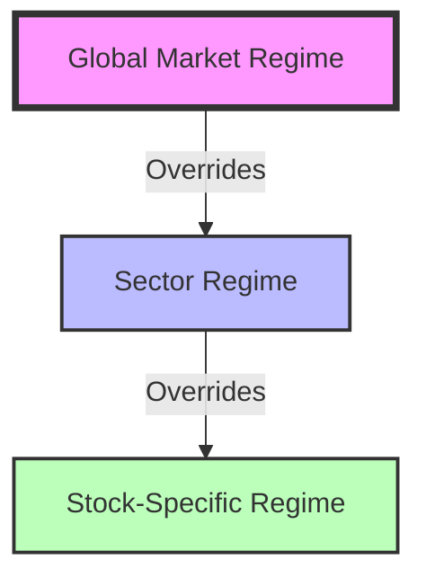

# Market Regime Detection System — Professional Architecture & Implementation Blueprint

**Version:** 1.1.0  
**Status:** ARCHITECTURE CHARTER  
**Author:** Systems Architecture Team  
**Last Updated:** 2026-01-15

---

## 1. Purpose of the Regime Layer (Why It Exists)

### Operational Definition
A **Market Regime** is a persistent, statistically observable state of market behavior that governs the probability of success for specific trading strategies. It is the "weather" in which the strategies operate.

### Core Responsibilities
The Regime Detection Layer functions exclusively as a **Gatekeeper**.
*   **DOES:** Quantify the current environment (e.g., "High Volatility, Trending").
*   **DOES:** Enable, disable, or throttle downstream strategies based on their compatibility with the environment.
*   **DOES:** Adjust risk parameters (e.g., widen stops in high volatility, reduce size in low liquidity).
*   **DOES NOT:** Generate trade signals (Entry/Exit).
*   **DOES NOT:** Predict future price movements (It is descriptive, not predictive).

> **Architectural Maxim:** Strategies ask "Is there a trade?" The Regime Layer answers "Is it safe to play?"

### 1.5 Epistemic Status of Regime (Critical Framing)

> [!WARNING]
> Regime is a **behavioral manifestation**, not a root cause. This distinction is architecturally critical.

**What Regime IS:**
- A classification of observable market behavior
- A downstream effect of underlying macro, flow, and structural conditions
- A gating mechanism for strategy compatibility

**What Regime is NOT:**
- A root cause of market movements
- An explanation of *why* the market behaves this way
- A predictive signal

**Upstream Dependency Declaration:**

```
macro_state → regime_classification
```

Regime classification is conditional on macro state. When macro state is unknown or uncertain:
1. Regime confidence MUST degrade
2. Regime outputs become conditional, not absolute
3. Downstream consumers must treat regime as "provisional"

**Failure Mode if Ignored:**
Treating regime as root cause leads to circular reasoning: "The market is trending because it's in TRENDING regime" explains nothing. The correct framing is: "The market is in TRENDING regime because macro conditions (liquidity, rates, flows) support directional persistence."

See: [latent_structural_layers.md](file:///c:/GIT/TraderFund/docs/epistemic/latent_structural_layers.md) for Macro Layer specification.

---

## 2. Regime Scope & Granularity Model

Regime detection operates efficiently by respecting a strict hierarchy of influence. A "No-Trade" condition at a higher level automatically explicitly blocks lower levels.

### Hierarchy & Precedence



### Responsibility Matrix

| Level | Scope | Responsibility | Typical Decision |
| :--- | :--- | :--- | :--- |
| **L1: Market** | Index (NIFTY 50, SPX) | Detect systemic shock, liquidity crises, or broad trends. | **Circuit Breaker:** "Stop all Long momentum strategies." |
| **L2: Sector** | Industry (Nifty Bank, Tech) | Detect sector rotation or sector-specific stress. | **Filter:** "Tech is range-bound; disable Trend strategies for Tech stocks." |
| **L3: Stock** | Individual Ticker | Detect idiosyncratic events (earnings, halts) or specific behavior. | **Risk Adjustment:** "Stock is hyper-volatile; reduce position size by 50%." |

**Precedence Rule:** A restrictive state at a higher level (e.g., Market = CRASH) ALWAYS overrides a permissive state at a lower level (e.g., Stock = TRENDING).

---

## 3. Regime Dimensions (Core Axes)

We utilize four orthogonal dimensions to classify market states. Adding more dimensions yields diminishing returns and increases the risk of "curse of dimensionality" (overfitting).

### 1. Trend (Directional Persistence)
*   **Definition:** The degree to which price action maintains a singular direction over time.
*   **Why:** Trend-following strategies fail in mean-reverting markets; Mean-reversion strategies die in strong trends.
*   **Breaks if Ignored:** Strategies on the wrong side of a trend suffer massive drawdowns.
*   **Role:** Determines if strategies should follow (Trend is High) or fade (Trend is Low).

### 2. Volatility (Amplitude of Variance)
*   **Definition:** The magnitude of price variance relative to a historical baseline.
*   **Why:** Volatility dictates risk per trade. Low vol requires leverage/larger size; High vol requires wider stops/smaller size.
*   **Breaks if Ignored:** Stops are hit purely by noise (if vol ignored) or capital is inefficiently deployed.
*   **Role:** Determines position sizing and stop-loss width.

### 3. Liquidity (Execution Efficiency)
*   **Definition:** The capacity of the market to absorb order flow without significant price impact (slippage).
*   **Why:** In illiquid markets, technical application builds false premises.
*   **Breaks if Ignored:** Slippage destroys alpha; "ghost" signals appear on thin order books.
*   **Role:** Determines if execution is technically feasible or cost-prohibitive.

### 4. Event / Information Pressure (External Catalyst)
*   **Definition:** The density and significance of external information flow affecting price discovery.
*   **Why:** Events disrupt statistical properties of price. Technicals fail during binary events (e.g., Earnings).
*   **Breaks if Ignored:** Strategies gamble on coin-flips (Earnings) or get stopped out by news spikes.
*   **Role:** Toggles between "Technical" and "Fundamental/News" dominance.

---

## 4. Indicator Framework per Dimension

*Architecture Note: Do not hardcode specific indicators. Implement interfaces that allow swappable implementations.*

### 1. Trend Framework
*   **Primary Role (Strength):** Quantify the strength of the trend regardless of direction.
    *   *Interface:* `ITrendStrengthProvider` -> returns `float` (0.0 to 1.0).
*   **Secondary Role (Alignment):** Confirm directionality across multiple timeframes.
    *   *Interface:* `ITrendAlignmentProvider` -> returns `Enum` (Aligned_Bull, Aligned_Bear, Mixed).
*   **Configuration:**
    *   Lookback periods must be configurable per asset class (Short for Crypto/India, Long for Forex/US).

### 2. Volatility Framework
*   **Primary Role (Expansion):** Compare current volatility to a historical baseline.
    *   *Interface:* `IVolatilityRatioProvider` -> returns `float` (Current / Baseline).
*   **Secondary Role (Extremes):** Identify statistical outliers (e.g., > 3 Std Dev).
    *   *Interface:* `IVolatilityPercentileProvider` -> returns `percentile` (0-100).
*   **Configuration:**
    *   Baseline method (SMA vs EMA) and window length must be parameterized.

### 3. Liquidity Framework
*   **Primary Role (Volume):** measures relative activity levels.
    *   *Interface:* `IRelativeVolumeProvider` -> returns `ratio` (Current / Avg).
*   **Secondary Role (Cost):** measures cost of entry/exit.
    *   *Interface:* `ISpreadCostProvider` -> returns `basis_points`.

### 4. Event Framework
*   **Primary Role (Horizon):** Calculate time-distance to known critical events.
    *   *Interface:* `IEventCalendarProvider` -> returns `minutes_to_impact`.
*   **Secondary Role (Velocity):** Measure real-time information density (news arrival rate).
    *   *Interface:* `INewsVelocityProvider` -> returns `events_per_minute`.

---

## 5. Regime Taxonomy (Actionable Regime States)

We decouple the **Behavioral State** from the **Directional Bias**. This reduces the number of unique regimes and simplifies strategy mapping.

### Behavioral States

| Regime Name | Description | Market Behavior | Strategy Implications |
| :--- | :--- | :--- | :--- |
| **1. TRENDING_NORMAL_VOL** | Strong Persistence, Stable variance. | Steady climb/decline, shallow pullbacks. | **Allow:** Momentum, Trend Following. **Block:** Counter-Trend Fading. |
| **2. TRENDING_HIGH_VOL** | Strong Persistence, Expanding variance. | Violent moves in trend direction, deep shakeouts. | **Allow:** Momentum (Reduced Size). **Strict:** Wide Stops. |
| **3. MEAN_REVERTING_LOW_VOL** | Low Persistence, Contained variance. | Price chops within bands, boring. | **Allow:** Mean Reversion, Income/Theta. **Block:** Breakout. |
| **4. MEAN_REVERTING_HIGH_VOL** | Low Persistence, High variance. | Whippy, false breakouts, stop hunting. | **Allow:** Scalping / HFT only. **Penalize:** Swing Trades. |
| **5. EVENT_DOMINANT** | News driving price. | Discontinuous pricing but tradable. | **Allow:** News-Based / Event-Driven Strategies. **Block:** Pure Technicals. |
| **6. EVENT_LOCK** | Binary Outcome Pending. | Pre-announcement freeze or halt. | **BLOCK ALL.** Capital Preservation. |
| **7. UNDEFINED / TRANSITION** | Conflicting signals. | Statistical properties weak/unstable. | **Reduced Risk.** Defensive Posture. |

### Directional Bias Attribute
*   **BULLISH:** Market structure suggests upside.
*   **BEARISH:** Market structure suggests downside.
*   **NEUTRAL:** No discernable directional edge.

*Note: A regime is defined as `{State: TRENDING_NORMAL_VOL, Bias: BULLISH}`.*

---

## 6. Regime Detection Logic Flow (Decision Process)

The engine evaluates sequentially. "Fail fast" logic applies (i.e., check exclusionary criteria first).

1.  **Check Data & Governance:**
    *   Is data integrity valid? If no -> `SYSTEM_HALT`.
    *   Is market open? If no -> `MARKET_CLOSED`.

2.  **Evaluating Event Constraints:**
    *   Is specific time critical event imminent? (e.g., Earnings in < X mins).
    *   *Decision:* If Yes -> `EVENT_LOCK`.

3.  **Evaluate Liquidity:**
    *   Is cost of trade prohibitive?
    *   *Decision:* If Yes -> `LIQUIDITY_DRY` (treated as No Trade).

4.  **Determine Behavioral State:**
    *   Compute Trend Strength & Volatility Expansion interactions.
    *   Map to one of the 5 tradable states (`TRENDING`, `MEAN_REVERTING`, etc.).

5.  **Determine Directional Bias:**
    *   Evaluate alignment of Moving Averages / Price Structure.
    *   Assign `BULLISH` | `BEARISH` | `NEUTRAL`.

6.  **Synthesize Final Output:**
    *   Construct Regime Object.

7.  **Conflict Resolution:**
    *   If Trend Indicators conflict with Volatility Indicators (e.g., Sideways but Extreme Vol) -> Default to Higher Risk State (`MEAN_REVERTING_HIGH_VOL`).

---

## 7. Regime Confidence & Stability Model

Confidence is not a derived formula but a measure of **Signal Quality** and **Persistence**.

### Confidence Model Components
1.  **Confluence:** Degree of agreement between Primary and Secondary roles.
    *   *High:* All indicators align.
    *   *Low:* Primary says Trend, Secondary says Chop.
2.  **Persistence:** Duration the market has remained in the current state.
    *   Regimes effectively "earn" confidence over time.
3.  **Intensity:** Magnitude of the signals (e.g., Trend Strength is top decile vs barely positive).

### Stability & Hysteresis
*   **Switching Cost:** The system must penalize rapid switching.
*   **Confirmation Window:** A new regime must hold for `N` periods before being broadcast as "Stable".
*   **Decay Logic:** Confidence erodes if conflicting data appears, even if the primary classification hasn't flipped yet.

---

## 8. Regime Output Schema (Machine-Readable)

Downstream consumers subscribe to this specific interface.

```json
{
  "timestamp": "2026-01-15T10:30:00Z",
  "scope": {
    "market": "IND",
    "symbol": "NIFTY50",
    "level": "MARKET"
  },
  "regime": {
    "behavior": "TRENDING_NORMAL_VOL", // The "Weather"
    "bias": "BULLISH",                 // The "Wind Direction"
    "id": "TR_NORM_BULL",
    "confidence_score": 0.85,          // 0.0 - 1.0 abstract qualitative score
    "is_stable": true
  },
  "dimensions": {
    "trend_strength_norm": 0.76,       // Normalized 0-1
    "volatility_ratio": 1.1,           // Relative
    "liquidity_status": "NORMAL"
  },
  "constraints": {
    "allowed_strategy_types": ["MOMENTUM", "TREND_FOLLOWING"],
    "blocked_strategy_types": ["MEAN_REVERSION_FADE"],
    "risk_modifiers": {
      "size_multiplier": 1.0,
      "stop_width_multiplier": 1.0
    }
  },
  "metadata": {
    "trigger_reason": "ADX_EXPANSION_CONFIRMED",
    "event_lock_active": false
  }
}
```

---

## 9. Strategy Compatibility Mapping

This configuration file resides in the Strategy Engine, referencing the Regime Signal.

| Strategy Class | Trending (Normal) | Trending (High Vol) | Mean Rev (Low Vol) | Mean Rev (High Vol) | Event Dominant |
| :--- | :--- | :--- | :--- | :--- | :--- |
| **Momentum** | **FULL SIZE** | 0.5x SIZE | BLOCKED | BLOCKED | BLOCKED |
| **Pullback** | **FULL SIZE** | 0.5x SIZE | 0.5x SIZE | BLOCKED | BLOCKED |
| **Mean Reversion** | BLOCKED | BLOCKED | **FULL SIZE** | 0.5x SIZE | BLOCKED |
| **Scalping** | 1.0x | 1.0x | 1.0x | **FULL SIZE** | 0.5x |
| **News/Event** | BLOCKED | BLOCKED | BLOCKED | BLOCKED | **FULL SIZE** |

**Enforcement:**
*   Strategies register their "Class" upon initialization.
*   The Execution Engine checks the map against the current Regime before processing any signal.

---

## 10. No-Trade Regime (Capital Preservation Layer)

The most profitable trade is often **no trade**.

### Triggers for `NO_TRADE` (Kill Switch)
1.  **System Health:** Data feed latency or errors.
2.  **Market Structure:** Exchange-mandated Circuit Breakers.
3.  **Liquidity Crisis:** Spreads exceed defined safety thresholds.
4.  **Event Lock:** Pre-defined binary event windows (Earnings released in T-10m).
5.  **Low Confidence:** System cannot strictly classify the behavior (Confusion).

### Logic
*   **Cancel All Open Limit Orders.**
*   **Tighten Stops on Open Positions** (or liquidation if Policy dictates).
*   **Reject New Signal Generation.**

---

## 11. Validation & Backtesting Framework

We do not backtest PnL here; we backtest **Detection Accuracy** and **Regret**.

### Validation Metrics
1.  **Stability Index:** Frequency of regime changes. (Too high = signal noise).
2.  **Lead/Lag Analysis:** Did `HIGH_VOL` triggers appear *before* the realized volatility moves?
3.  **Classification Accuracy:** Visual inspection of Regime overlay on price charts.

### Regime–Strategy Regret Analysis
*   **Goal:** Measure if the Regime Layer *saved* money or *cost* money.
*   **Metric:** `Regret = PnL(Strategy_Unfiltered) - PnL(Strategy_Filtered)`.
*   **Positive Result:** Filtered PnL > Unfiltered PnL (Regime avoided losses).
*   **Negative Result:** Unfiltered PnL > Filtered PnL (Regime blocked winning trades).
*   **Action:** Tune Regime parameters to minimize Regret while maximizing drawdown reduction.

---

## 12. Operational Considerations

*   **Latency Budget:** Regime calculation must complete in < `N` ms (defined by SLA).
*   **Cold Start:** Engine requires history buffering. Define behavior during warm-up (default to `UNDEFINED` or `SAFE`).
*   **Market Hours:**
    *   *Pre-Market:* Regime defaults to `UNCERTAIN`.
    *   *Open/Close:* Handling of auction periods and volatility spikes.
*   **Resiliency:**
    *   Graceful degradation: If Secondary indicators fail, rely on Primary. If Primary fail, `NO_TRADE`.

---

## 13. System Integration Architecture

```text
[Market Data Feed] --> [Indicator Abstraction Layer] 
                              |
                              v
                      [Regime Detection Service]
                     /        |          \
           (State)  /         | (JSON)    \ (Risk Flags)
                   v          v            v
        [Dashboard UI]   [Strategy Engine]   [Risk Manager]
```

*   **Service Location:** Standalone Service or Library within Execution Core.
*   **Update Cadence:**
    *   Configurable: Tick-based, Time-based, or Hybrid (Time-based + Volatility Interrupt).

---

## 14. Anti-Patterns & Common Mistakes

*   **DON'T:** Use predictive indicators (e.g., "Elliott Wave says Wave 3"). Only use descriptive stats.
*   **DON'T:** Optimize specific parameters (e.g., "RSI 14 vs 15") for PnL. Optimize for behavior clustering.
*   **DON'T:** Mix Regime logic with Strategy logic. (e.g., "If RSI < 30" is a strategy entry, not a regime).
*   **DON'T:** Create too many regimes. "Bullish Trend with slight pullback on Tuesday" is overfitting.
*   **DON'T:** Ignore "No Trade". Forcing classification on random noise generates losses.

---

## 15. Phased Implementation Roadmap

### Phase 1: MVP (Market Level)
*   **Scope:** Global Market Index only.
*   **Deliverable:** Abstracted Interfaces for Trend/Vol, Simple JSON Output.
*   **Done Criteria:** Visual overlay on charts matches human intuition.

### Phase 2: Confidence & Integration
*   **Scope:** Connect to Strategy Engine.
*   **Deliverable:** Stability logic, Hysteresis, Strategy Compatibility Map.
*   **Done Criteria:** Strategies auto-throttle based on signal.

### Phase 3: Extension (Sector/Stock)
*   **Scope:** Roll out to constituents.
*   **Deliverable:** Event Calendar Integration, Liquidity Interfaces.
*   **Done Criteria:** Stock-specific regimes override Market regimes correctly.

### Phase 4: Observability & Attribution
*   **Scope:** Full Dashboard & Analytics.
*   **Deliverable:** Real-time heatmap, Regret Analysis tooling.
*   **Done Criteria:** Operational transparency for Trading Desk.
