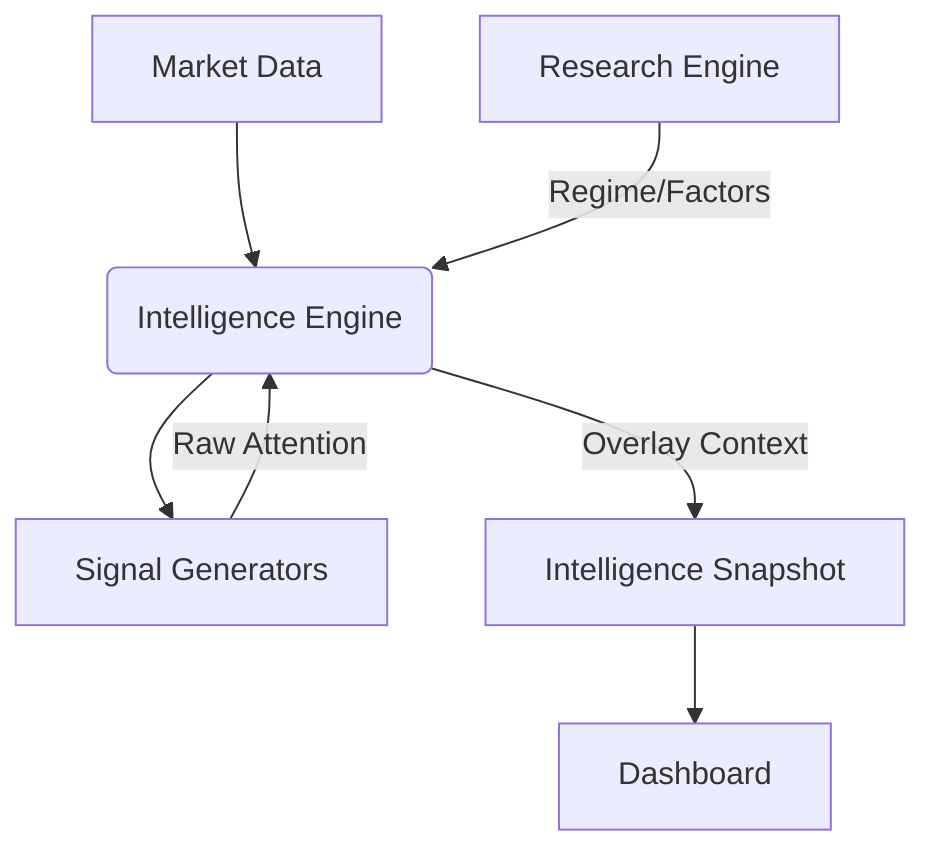

# DWBS: Intelligence Layer Implementation

**Type**: Implementation Definition  
**Plane**: Intelligence (Ring-3)  
**Execution Rights**: NONE  
**Status**: ACTIVE  

---

## 1. System Role & Boundaries

The **Intelligence Layer** is the system's "Pattern Recognition Cortex". It observes the market and surfaces interesting behaviors ("Attention Signals") but deliberately lacks the authority to act on them.

### Responsibilities
1.  **Observe**: Scan defined symbol universes (US/India) for anomalies.
2.  **Contextualize**: Overlay signals with Regime and Factor constraints (Blocked vs. Allowed).
3.  **Explain**: Provide human-readable reasons for every signal.
4.  **Defer**: Explicitly leave the "Decision" to the human operator.

### Hard Constraints (The "No-Go" List)
- **❌ NO Execution**: Cannot place orders or route to broker.
- **❌ NO Gating**: Cannot block the Research Engine (Evolution).
- **❌ NO Feedback**: Cannot modify Research parameters.
- **❌ NO State Mutation**: Cannot alter the system's core ledger.

---

## 2. Module Architecture



### Components

#### A. Symbol Universe Builder
- **Input**: Hardcoded lists or Index Constituents.
- **Output**: `symbol_universe.json` (Daily).
- **Logic**: Deterministic selection.

#### B. Signal Generators (Safe Heuristics)
- **Volatility**: Expansion/Contraction detection.
- **Volume**: Relative volume anomalies.
- **Price**: Gap detection, Range expansion.
- **Output**: `AttentionSignal` (Symbol, Type, Reason).

#### C. Intelligence Engine (Orchestrator)
- **Input**: Market Data + Research Context.
- **Process**: 
  1. Build Universe.
  2. Run Generators.
  3. Apply Research Overlay (Is this signal congruent with the Regime?).
  4. Generate Snapshot.
- **Output**: `intelligence_snapshot.json`.

---

## 3. Data Contracts

### 3.1 Input: Research Context
```json
{
  "regime": "INFLATION",
  "factors": { "momentum": "POSITIVE", "volatility": "NORMAL" }
}
```

### 3.2 Output: Intelligence Snapshot
```json
{
  "timestamp": "ISO-8601",
  "market": "US",
  "signals": [
    {
      "symbol": "TSLA",
      "type": "VOLATILITY_EXPANSION",
      "reason": "Daily range 2.5x average",
      "research_overlay": {
        "status": "BLOCKED",
        "reason": "Regime is HIGH_VOLATILITY, Momentum is NEUTRAL"
      }
    }
  ]
}
```
