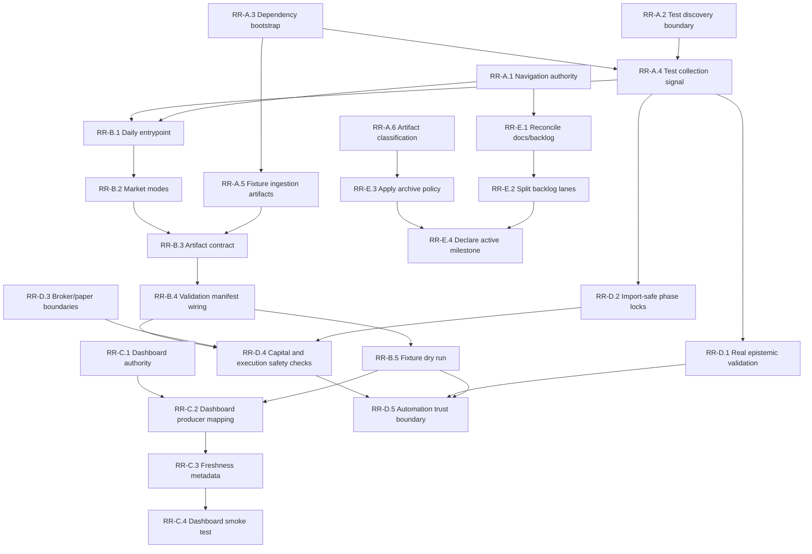

# DWBS: Repository Recovery Task Plan

**Status:** RECOVERY BASELINE COMPLETE  
**Type:** Recovery / Stabilization / Wiring  
**Created:** 2026-05-17  
**Source Assessment:** `docs/CURRENT_REPOSITORY_ASSESSMENT.md`  
**Execution Rights:** NONE until explicitly implemented  
**Primary Milestone:** Fixture-mode daily pipeline + trustworthy validation  

---

## 1. Purpose

This DWBS turns the repository assessment gaps into executable tasks.

The goal is not to add more trading capability yet. The goal is to bring the
repository back under control so future implementation has:

- one canonical map,
- one dependency and test setup,
- one artifact contract,
- one dry-run daily cycle,
- one dashboard authority,
- and governance checks that actually protect the system.

---

## 2. Recovery Principles

| ID | Principle | Meaning |
| :--- | :--- | :--- |
| RPR-1 | Stabilization before features | No new capability should be added until default inspection, test collection, and fixture validation are reliable. |
| RPR-2 | One operational spine | The repo must expose one documented daily dry-run path instead of many disconnected runners. |
| RPR-3 | Fixture mode first | Validation must be provable without broker credentials or live market/API access. |
| RPR-4 | Dashboard reads facts | Dashboard panels must load from declared producer artifacts and show freshness/missing-data state. |
| RPR-5 | Safety gates stay intact | Phase locks, broker guards, and capital safeguards remain, but should not break harmless imports or test discovery. |
| RPR-6 | Documentation must be navigable | Older docs may remain, but each must be current, historical, or archived. |

---

## 3. Task Identification Scheme

**Format:** `RR-<Phase>.<Item>`

| Prefix | Phase | Gate |
| :--- | :--- | :--- |
| RR-A | Repository Stabilization | Must complete before pipeline work |
| RR-B | Canonical Pipeline Selection | Must complete before dashboard freshness work |
| RR-C | Dashboard Authority and Freshness | Must complete before UI feature work |
| RR-D | Governance and Safety Hardening | Must complete before broader automation/live integration work |
| RR-E | Backlog and Documentation Reconciliation | Must complete before new roadmap expansion |

---

## 4. Phase A - Repository Stabilization

**Goal:** make the repo inspectable, installable, and test-collectable.

**Gate:** no canonical pipeline implementation should start until Phase A is closed.

### Task RR-A.1: Establish Current Navigation Authority

| Attribute | Value |
| :--- | :--- |
| **Status** | DONE |
| **Source Gap** | G-01 |
| **Purpose** | Make the assessment and recovery DWBS discoverable from the repository entry points. |
| **Targets** | `README.md`, docs index if present, `docs/CURRENT_REPOSITORY_ASSESSMENT.md`, this DWBS |
| **Work** | Add a short navigation section pointing developers to the current assessment, active DWBS, canonical architecture, backlog, and runbook. |
| **Acceptance Check** | A new developer can open `README.md` and find the current assessment and this DWBS without searching. |
| **Depends On** | None |
| **Blocks** | RR-E.1, RR-E.2 |

### Task RR-A.2: Define Default Test Discovery Boundary

| Attribute | Value |
| :--- | :--- |
| **Status** | DONE |
| **Source Gap** | G-04, G-08 |
| **Purpose** | Stop default pytest collection from being polluted by stale, archived, generated, or unsupported surfaces. |
| **Targets** | `pyproject.toml` or `pytest.ini`, `tests/`, `_delete/`, generated/runtime folders |
| **Work** | Add pytest configuration that declares supported test roots and excludes `_delete`, runtime artifacts, generated reports, and phase-disabled experiments from default collection. |
| **Acceptance Check** | `python -m pytest --collect-only -q` reaches collection completion for the selected default suite. |
| **Depends On** | None |
| **Blocks** | RR-A.4, RR-D.2 |

### Task RR-A.3: Repair Dependency and Environment Bootstrap

| Attribute | Value |
| :--- | :--- |
| **Status** | DONE |
| **Source Gap** | G-03 |
| **Purpose** | Make the supported Python environment explicit and reproducible. |
| **Targets** | `requirements.txt`, optional dependency files, README setup section, CI workflow references |
| **Work** | Confirm supported Python version, split dependency groups where useful, and document one clean install command for default tests and validation. |
| **Acceptance Check** | A clean environment can install the default dependency set without guessing missing packages such as `pandas`, `pydantic`, or database drivers needed by default checks. |
| **Depends On** | None |
| **Blocks** | RR-A.4, RR-A.5, RR-B.5 |

### Task RR-A.4: Restore Default Test Collection Signal

| Attribute | Value |
| :--- | :--- |
| **Status** | DONE |
| **Source Gap** | G-04, G-05 |
| **Purpose** | Make test collection a reliable health signal before implementation begins. |
| **Targets** | `tests/`, phase-locked modules, test import paths, pytest configuration |
| **Work** | Fix import-time errors that remain after the discovery boundary is declared; move unsafe phase checks out of harmless imports where appropriate. |
| **Acceptance Check** | `python -m pytest --collect-only -q` exits successfully for the default suite. |
| **Depends On** | RR-A.2, RR-A.3 |
| **Blocks** | RR-D.2, RR-D.4 |

### Task RR-A.5: Define Fixture-Mode Ingestion Artifacts

| Attribute | Value |
| :--- | :--- |
| **Status** | DONE |
| **Source Gap** | G-02 |
| **Purpose** | Let ingestion validation prove behavior without live API access. |
| **Targets** | `traderfund.validation`, ingestion fixture folders, data contract docs |
| **Work** | Decide whether to commit small fixtures, generate local fixtures, or add validator fixture-mode resolution for raw, processed, and market-specific artifacts. |
| **Acceptance Check** | Ingestion validation can pass in fixture mode or fail with exactly one documented live-data prerequisite. |
| **Depends On** | RR-A.3 |
| **Blocks** | RR-B.3, RR-B.4, RR-B.5 |

### Task RR-A.6: Classify Generated and Historical Artifacts

| Attribute | Value |
| :--- | :--- |
| **Status** | DONE |
| **Source Gap** | G-08 |
| **Purpose** | Reduce repo noise and prevent stale executable files from acting like active code. |
| **Targets** | `_delete/`, `logs/`, `artifacts/`, runtime reports, screenshots, generated docs, `.gitignore` |
| **Work** | Create an archive/ignore policy and identify which outputs stay in git, move to archive, or become ignored runtime output. |
| **Acceptance Check** | Default repo navigation and test collection no longer treat obsolete generated outputs as active source. |
| **Depends On** | RR-A.2 |
| **Blocks** | RR-E.3 |

---

## 5. Phase B - Canonical Pipeline Selection

**Goal:** define one daily cycle and one artifact contract.

**Gate:** dashboard freshness work should not start until producers and artifacts are declared.

### Task RR-B.1: Choose the Daily Pipeline Entrypoint

| Attribute | Value |
| :--- | :--- |
| **Status** | DONE |
| **Source Gap** | Wiring: canonical daily cycle |
| **Purpose** | Stop the repo from having many possible daily runners with no declared authority. |
| **Targets** | `infra_hardening/scheduler/wrapper.py`, candidate existing scripts, or new `traderfund.pipeline.daily` module |
| **Work** | Choose whether to extend an existing wrapper, promote an existing script, or create a new daily pipeline module. |
| **Acceptance Check** | One documented command is named as the canonical fixture/dry-run daily cycle. |
| **Depends On** | RR-A.1, RR-A.4 |
| **Blocks** | RR-B.2, RR-B.5 |

### Task RR-B.2: Define Market Modes

| Attribute | Value |
| :--- | :--- |
| **Status** | DONE |
| **Source Gap** | Open Decision 1 |
| **Purpose** | Make US, India, and fixture/demo behavior explicit. |
| **Targets** | pipeline config, validation config, runbook |
| **Work** | Define supported market modes, required inputs, fixture behavior, and unavailable/live-only prerequisites. |
| **Acceptance Check** | The daily command can be invoked in fixture mode without live credentials, and market mode errors are explicit. |
| **Depends On** | RR-B.1 |
| **Blocks** | RR-B.3, RR-B.5 |

### Task RR-B.3: Define Canonical Artifact Contract

| Attribute | Value |
| :--- | :--- |
| **Status** | DONE |
| **Source Gap** | G-02, Wiring: ingestion to validation, ingestion to research |
| **Purpose** | Ensure ingestion, research, validation, reports, and dashboard all agree on file locations and schemas. |
| **Targets** | data contract docs, manifest schema, validation artifact resolution |
| **Work** | Declare canonical paths for raw data, processed data, research outputs, intelligence state, evaluation bundles, reports, and dashboard inputs. |
| **Acceptance Check** | A manifest lists every produced artifact with producer, path, schema/version, timestamp, and market mode. |
| **Depends On** | RR-A.5, RR-B.2 |
| **Blocks** | RR-B.4, RR-B.5, RR-C.2 |

### Task RR-B.4: Wire Validation to the Artifact Manifest

| Attribute | Value |
| :--- | :--- |
| **Status** | DONE |
| **Source Gap** | G-02, Wiring: validation to scheduler |
| **Purpose** | Make validators consume declared artifacts instead of guessing paths. |
| **Targets** | `traderfund.validation`, validation runner CLI, manifest reader |
| **Work** | Add manifest-aware artifact lookup and make missing data errors name the missing producer and path. |
| **Acceptance Check** | Ingestion validation reads fixture-mode artifacts from the manifest and reports actionable missing-data causes. |
| **Depends On** | RR-B.3 |
| **Blocks** | RR-B.5, RR-D.4 |

### Task RR-B.5: Build Fixture-Mode Daily Dry Run

| Attribute | Value |
| :--- | :--- |
| **Status** | DONE |
| **Source Gap** | Wiring: one operational spine |
| **Purpose** | Prove the repository has one safe end-to-end daily path. |
| **Targets** | canonical pipeline entrypoint, validation runner, artifact manifest, summary reports |
| **Work** | Implement or wire the dry-run cycle: load fixture artifacts, validate ingestion, run selected research/intelligence stages, emit manifest, emit validation summaries, and avoid broker/live writes. |
| **Acceptance Check** | One command completes in fixture mode and writes an artifact manifest plus validation summary. |
| **Depends On** | RR-B.1, RR-B.2, RR-B.3, RR-B.4 |
| **Blocks** | RR-C.2, RR-C.4, RR-D.5 |

---

## 6. Phase C - Dashboard Authority and Freshness

**Goal:** make the maintained dashboard read canonical artifacts and explain freshness.

### Task RR-C.1: Declare Canonical Dashboard Surface

| Attribute | Value |
| :--- | :--- |
| **Status** | DONE |
| **Source Gap** | G-06 |
| **Purpose** | Prevent UI work from landing in the wrong dashboard. |
| **Targets** | `src/dashboard/backend`, `src/dashboard/frontend`, legacy `dashboard/`, README/docs |
| **Work** | Declare whether `src/dashboard` is canonical and whether `dashboard/` is legacy/read-only, archived, or still supported. |
| **Acceptance Check** | README and docs clearly identify the maintained dashboard path. |
| **Depends On** | RR-A.1 |
| **Blocks** | RR-C.2, RR-C.4 |

### Task RR-C.2: Map Dashboard Loaders to Producer Artifacts

| Attribute | Value |
| :--- | :--- |
| **Status** | DONE |
| **Source Gap** | Wiring: evaluation to dashboard |
| **Purpose** | Ensure every dashboard panel reads real producer output. |
| **Targets** | dashboard backend loaders, artifact manifest, dashboard docs |
| **Work** | Inventory each loader/panel and map it to the producing job, artifact path, schema/version, and missing-data behavior. |
| **Acceptance Check** | Every dashboard loader has a documented producer and artifact in the manifest. |
| **Depends On** | RR-B.3, RR-B.5, RR-C.1 |
| **Blocks** | RR-C.3, RR-C.4 |

### Task RR-C.3: Add Freshness and Provenance Metadata

| Attribute | Value |
| :--- | :--- |
| **Status** | DONE |
| **Source Gap** | Wiring: dashboard freshness |
| **Purpose** | Make stale or missing dashboard data visible instead of silent. |
| **Targets** | dashboard API responses, frontend panels, manifest metadata |
| **Work** | Add produced-at, source artifact, market mode, validation state, and missing-data reason fields to dashboard-facing responses. |
| **Acceptance Check** | Dashboard panels can show data freshness and why data is missing. |
| **Depends On** | RR-C.2 |
| **Blocks** | RR-C.4 |

### Task RR-C.4: Add Dashboard Fixture Smoke Test

| Attribute | Value |
| :--- | :--- |
| **Status** | DONE |
| **Source Gap** | Dashboard reliability |
| **Purpose** | Prove the canonical dashboard can start from fixture artifacts. |
| **Targets** | dashboard backend tests, frontend build, fixture manifest |
| **Work** | Add a backend endpoint smoke test and frontend build check tied to fixture-mode artifacts. |
| **Acceptance Check** | Backend loaders run in fixture mode and `npm run build` succeeds in `src/dashboard/frontend`. |
| **Depends On** | RR-C.1, RR-C.2, RR-C.3 |
| **Blocks** | Future dashboard feature work |

---

## 7. Phase D - Governance and Safety Hardening

**Goal:** restore real safety enforcement without blocking normal development inspection.

### Task RR-D.1: Replace Epistemic Placeholder Validation

| Attribute | Value |
| :--- | :--- |
| **Status** | DONE |
| **Source Gap** | G-07 |
| **Purpose** | Stop CI from passing with only placeholder governance checks. |
| **Targets** | `scripts/epistemic_validator.py`, CI workflow, governance docs |
| **Work** | Replace placeholder output with concrete checks or rename/scope it honestly as smoke-only until full enforcement exists. |
| **Acceptance Check** | CI performs at least one meaningful repo/document/policy check and fails on violation. |
| **Depends On** | RR-A.4 |
| **Blocks** | RR-D.5 |

### Task RR-D.2: Move Phase-Lock Failures Out of Harmless Imports

| Attribute | Value |
| :--- | :--- |
| **Status** | DONE |
| **Source Gap** | G-05 |
| **Purpose** | Keep phase safety while allowing tests and docs to import modules. |
| **Targets** | phase-locked research modules, paper trading modules, tests |
| **Work** | Gate unsafe execution paths at constructors, commands, or runtime entrypoints rather than module import where possible. |
| **Acceptance Check** | Phase-locked packages can be imported for test discovery without enabling execution. |
| **Depends On** | RR-A.4 |
| **Blocks** | RR-D.4 |

### Task RR-D.3: Define Broker and Paper-Trading Operation Boundaries

| Attribute | Value |
| :--- | :--- |
| **Status** | DONE |
| **Source Gap** | Wiring: portfolio/broker to intelligence |
| **Purpose** | Prevent accidental live execution while preserving safe portfolio intelligence and paper workflows. |
| **Targets** | broker connector docs, paper trading modules, config, validation |
| **Work** | Document allowed read, paper, shadow, and forbidden live operations; define credential and fallback behavior. |
| **Acceptance Check** | The repo states which paths are research-only, observation-only, paper-only, and live-forbidden. |
| **Depends On** | RR-A.1 |
| **Blocks** | RR-D.4, RR-D.5 |

### Task RR-D.4: Add Capital and Execution Safety Checks

| Attribute | Value |
| :--- | :--- |
| **Status** | DONE |
| **Source Gap** | Governance safety |
| **Purpose** | Make safety invariants executable in the default validation suite. |
| **Targets** | validation framework, capital/execution modules, CI |
| **Work** | Add checks that confirm fixture/dry-run mode performs no broker writes, no live order placement, and no unauthorized capital mutation. |
| **Acceptance Check** | Safety validation fails if dry-run or fixture mode attempts a live/broker/capital side effect. |
| **Depends On** | RR-B.4, RR-D.2, RR-D.3 |
| **Blocks** | RR-D.5 |

### Task RR-D.5: Define Automation Agent Trust Boundary

| Attribute | Value |
| :--- | :--- |
| **Status** | DONE |
| **Source Gap** | Wiring: automation agents to core repo |
| **Purpose** | Prevent automation from expanding drift or modifying unsafe surfaces without validation. |
| **Targets** | `automation/`, `.agent/skills`, docs/runbooks |
| **Work** | Document allowed write scopes, required validations, escalation rules, and forbidden areas for Jules/Gemini/autonomous loops. |
| **Acceptance Check** | Automation agents have an explicit trust boundary and merge/readiness checks. |
| **Depends On** | RR-B.5, RR-D.1, RR-D.4 |
| **Blocks** | Broader automation rollout |

---

## 8. Phase E - Backlog and Documentation Reconciliation

**Goal:** convert scattered docs and status files into one usable execution backlog.

### Task RR-E.1: Reconcile Current Status and Backlog Documents

| Attribute | Value |
| :--- | :--- |
| **Status** | DONE |
| **Source Gap** | G-01 |
| **Purpose** | Remove ambiguity between overlapping architecture, backlog, status, and memory docs. |
| **Targets** | `docs/IMPLEMENTATION_STATUS.md`, `docs/System_Backlog_and_Refinements.md`, architecture docs, roadmap docs |
| **Work** | Merge the active status/backlog into one current backlog or label older docs as historical/reference. |
| **Acceptance Check** | README points to one current backlog and labels historical docs clearly. |
| **Depends On** | RR-A.1 |
| **Blocks** | RR-E.2, RR-E.4 |

### Task RR-E.2: Split Backlog by Recovery Lanes

| Attribute | Value |
| :--- | :--- |
| **Status** | DONE |
| **Source Gap** | Product backlog refresh |
| **Purpose** | Make future picking easy and reduce mixed-scope work. |
| **Targets** | current backlog file |
| **Work** | Split tasks into stabilization, wiring, dashboard, data, intelligence, governance, and future research. |
| **Acceptance Check** | Every task appears in exactly one lane with status, owner placeholder, date, and acceptance check. |
| **Depends On** | RR-E.1 |
| **Blocks** | RR-E.4 |

### Task RR-E.3: Apply Archive/Ignore Policy

| Attribute | Value |
| :--- | :--- |
| **Status** | DONE |
| **Source Gap** | G-08 |
| **Purpose** | Execute the generated/historical artifact classification from Phase A. |
| **Targets** | `_delete/`, generated artifacts, logs, `.gitignore`, documentation audit |
| **Work** | Move, ignore, or label artifacts according to the approved policy without deleting useful evidence prematurely. |
| **Acceptance Check** | Source tree no longer exposes stale generated files as active work, and evidence artifacts remain traceable. |
| **Depends On** | RR-A.6 |
| **Blocks** | RR-E.4 |

### Task RR-E.4: Declare the Next Implementation Milestone

| Attribute | Value |
| :--- | :--- |
| **Status** | DONE |
| **Source Gap** | Recovery planning |
| **Purpose** | Give the team one clear near-term target after the DWBS is accepted. |
| **Targets** | current backlog, README navigation, recovery runbook |
| **Work** | Promote "Fixture-mode daily pipeline + trustworthy validation" as the active milestone and list the tasks required to close it. |
| **Acceptance Check** | Future feature work depends on milestone closure or an explicit decision to defer it. |
| **Depends On** | RR-E.1, RR-E.2, RR-E.3 |
| **Blocks** | New feature roadmap expansion |

---

## 9. Execution Order

The recommended pick order is:

1. RR-A.2 - Define Default Test Discovery Boundary
2. RR-A.3 - Repair Dependency and Environment Bootstrap
3. RR-A.4 - Restore Default Test Collection Signal
4. RR-A.5 - Define Fixture-Mode Ingestion Artifacts
5. RR-A.1 - Establish Current Navigation Authority
6. RR-B.1 - Choose the Daily Pipeline Entrypoint
7. RR-B.2 - Define Market Modes
8. RR-B.3 - Define Canonical Artifact Contract
9. RR-B.4 - Wire Validation to the Artifact Manifest
10. RR-B.5 - Build Fixture-Mode Daily Dry Run
11. RR-C.1 - Declare Canonical Dashboard Surface
12. RR-C.2 - Map Dashboard Loaders to Producer Artifacts
13. RR-C.3 - Add Freshness and Provenance Metadata
14. RR-C.4 - Add Dashboard Fixture Smoke Test
15. RR-D.1 - Replace Epistemic Placeholder Validation
16. RR-D.2 - Move Phase-Lock Failures Out of Harmless Imports
17. RR-D.3 - Define Broker and Paper-Trading Operation Boundaries
18. RR-D.4 - Add Capital and Execution Safety Checks
19. RR-D.5 - Define Automation Agent Trust Boundary
20. RR-A.6 - Classify Generated and Historical Artifacts
21. RR-E.1 - Reconcile Current Status and Backlog Documents
22. RR-E.2 - Split Backlog by Recovery Lanes
23. RR-E.3 - Apply Archive/Ignore Policy
24. RR-E.4 - Declare the Next Implementation Milestone

---

## 10. Blocking Dependency Map

---

## 11. Definition of Done

This recovery DWBS is complete when:

- `python -m pytest --collect-only -q` succeeds for the selected default suite.
- Default dependencies install from one documented command in a clean environment.
- Fixture-mode ingestion validation succeeds without live credentials.
- One dry-run daily pipeline command emits an artifact manifest and validation summary.
- The maintained dashboard path is declared.
- Dashboard loaders map to producer artifacts and expose freshness/missing-data state.
- Governance checks are concrete, not placeholders.
- Phase locks preserve safety without breaking harmless imports.
- Broker/live execution paths remain gated and auditable.
- README points to one current assessment, one architecture reference, one backlog, and one runbook.

---

## 12. Open Decisions to Resolve During Task Execution

| Decision | Needed By | Options |
| :--- | :--- | :--- |
| Canonical market priority | RR-B.2 | US-first, India-first, or dual-market fixture mode |
| Canonical dashboard | RR-C.1 | `src/dashboard` only, legacy `dashboard/` retained read-only, or archived |
| Canonical data contract | RR-B.3 | Commit fixtures, generated fixtures, or live-only with documented prerequisite |
| Dependency policy | RR-A.3 | Single requirements file, grouped extras, or separate runtime/dev/research files |
| Phase-lock policy | RR-D.2 | Import-time gate, runtime gate, or mixed policy by risk |
| Generated artifact policy | RR-A.6 | Keep, ignore, archive, or move outside repo |
| Automation trust boundary | RR-D.5 | Read-only, scoped writes, or full writes behind validation gates |

---

## 13. Next Task Selection Rule

The recovery baseline is complete. Future implementation should start from a
new dated DWBS or a current roadmap that explicitly references
`docs/recovery/RECOVERY_BACKLOG_2026-05-17.md`.

Do not pick directly from historical backlog, implementation status, or vision
documents. Promote any future work into a current backlog with owner placeholder,
date, status, dependencies, and acceptance check before implementation.
