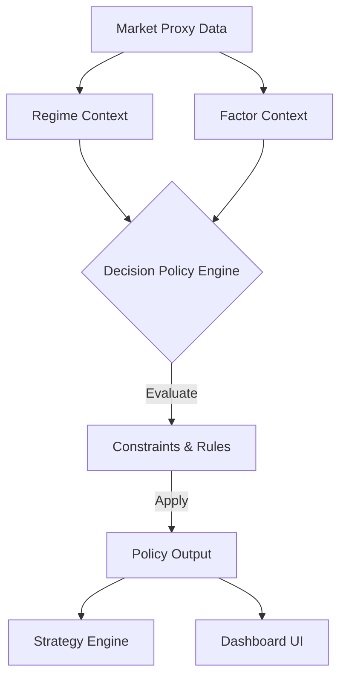

# Decision Policy Flow Architecture

## 1. Data Flow Diagram


## 2. Component Design

### 2.1. DecisionPolicyEngine (Class)
*   **Responsibility**: Stateless evaluator of Context -> Permissions.
*   **Location**: `src/decision/policy_engine.py`
*   **Interface**:
    ```python
    def evaluate(regime: RegimeContext, factors: FactorContext) -> DecisionPolicy:
        # Constraint Checks
        # Rule Application
        return policy
    ```

### 2.2. Constraints Library
*   **Responsibility**: Modular logic blocks for specific prohibitions.
*   **Examples**:
    *   `ConstraintProxyDegraded`
    *   `ConstraintLiquidityCrisis`
    *   `ConstraintRegimeAmbiguous`

## 3. Workflow Integration
1.  **Ignition**: `market_loader` runs.
2.  **Truth**: `context_builders` run (Regime/Factor).
3.  **Policy**: `policy_engine` runs utilizing Truth.
4.  **Execution**: `strategy_runner` reads Policy. IF `ALLOW_LONG_ENTRY` is missing, it skips the scan loop.

## 4. Fail-Safe Wiring
*   If `policy_engine` crashes -> Default output is `OBSERVE_ONLY`.
*   If `Context` is Stale -> Policy treats invalid input as `UNCERTAIN` -> `OBSERVE_ONLY`.
