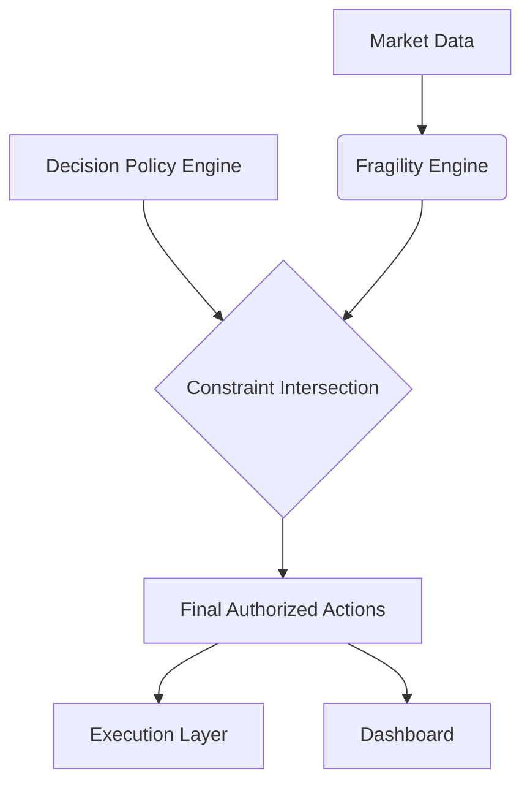

# Fragility Policy Flow Diagram

## 1. High-Level Flow

## 2. Component Logic

### 2.1. Signal Detection
The `FragilityEngine` monitors rate of change (ROC) and absolute levels of:
*   `Rates` (`^TNX`) -> Liquidity Stress
*   `Vol` (`VIX`) -> Volatility Stress
*   `Regime History` -> Transition Stress

### 2.2. State Aggregation
Signals are aggregated into a single `StressState` enum.
*   Priority: `SYSTEMIC` > `TRANSITION` > `ELEVATED` > `NORMAL`.
*   *Fail-Safe*: Missing data defaults to `ELEVATED` (Cautionary).

### 2.3. Dashboard Projection
The dashboard displays the Fragility Layer as a separate "System Stability" card.
It does **NOT** hide the base Decision Policy. Instead, it shows "Decision says GO, but Fragility says STOP".
This "Conflict Visibility" is crucial for operator trust.

## 3. Intersection Logic
*   **Input**: `DecisionPolicy.permissions = ['ALLOW_LONG', 'ALLOW_HOLD']`
*   **Input**: `FragilityPolicy.constraints = ['BLOCK_LONG']`
*   **Result**: `Final.permissions = ['ALLOW_HOLD']`

## 4. India Handling
Since India is `DEGRADED`, the Decision Policy already output `OBSERVE_ONLY`.
Fragility Layer for India returns `NOT_EVALUATED`.
Intersecting `OBSERVE_ONLY` with `NOT_EVALUATED` results in `OBSERVE_ONLY`.
The system remains consistent.
