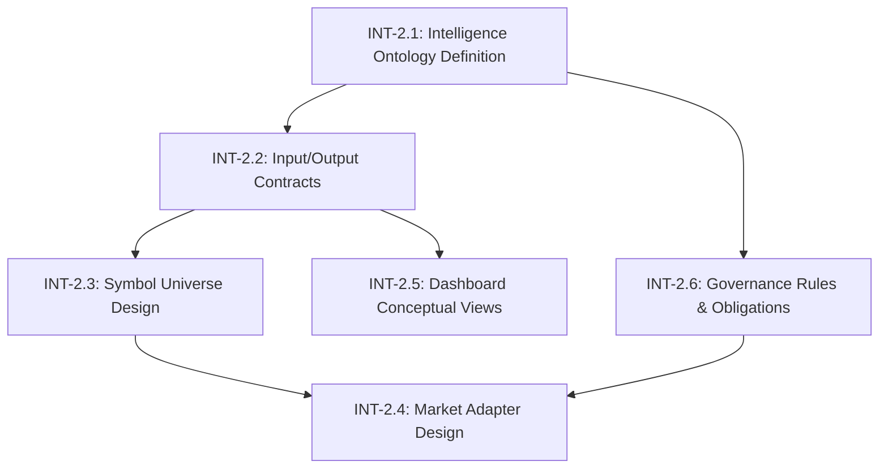

# Task Graph: Intelligence Layer Design (Step-2)

**Status**: ACTIVE
**Parent**: `task_graph.md`
**Focus**: Intelligence Layer Design & Ontology

---

## 1. Objectives
To define the structural and semantic rules for the Intelligence Layer before any implementation begins. This ensures that "Decision Support" never accidentally becomes "Decision Automation".

## 2. Task Graph

## 3. Task Details

### INT-2.1: Intelligence Ontology Definition
- **Goal**: Define what "Intelligence" means vs "Research".
- **Deliverable**: Canonical definition in DWBS.
- **Status**: ✅ COMPLETE (`DWBS_INTELLIGENCE_LAYER.md`)

### INT-2.2: Input/Output Contracts
- **Goal**: Define exactly what data enters and leaves the layer.
- **Deliverable**: I/O section in DWBS.
- **Status**: ✅ COMPLETE (`DWBS_INTELLIGENCE_LAYER.md`)

### INT-2.3: Symbol Universe Design
- **Goal**: Define how the universe is narrowed heuristically.
- **Deliverable**: SymbolUniverse contract in DWBS.
- **Status**: ✅ COMPLETE (`DWBS_INTELLIGENCE_LAYER.md`)

### INT-2.4: Market Adapter Design
- **Goal**: Design the US and India adapters.
- **Deliverable**: Adapter specifications in DWBS.
- **Status**: ✅ COMPLETE (`DWBS_INTELLIGENCE_LAYER.md`)

### INT-2.5: Dashboard Conceptual Views
- **Goal**: conceptualize how this looks to a human.
- **Deliverable**: Dashboard concepts in DWBS.
- **Status**: ✅ COMPLETE (`DWBS_INTELLIGENCE_LAYER.md`)

### INT-2.6: Governance Rules & Obligations
- **Goal**: Bind the layer with safety rules.
- **Deliverable**: Updated Obligation Index.
- **Status**: ✅ COMPLETE (`obligation_index.md`)

## 4. Completion Criteria
- [x] Intelligence Layer is clearly defined.
- [x] No execution ambiguity exists.
- [x] All decision-adjacent artifacts have a future home.
- [x] Dashboard views are conceptually clear.
- [x] India integration is planned but not implemented.

**Outcome**: The Intelligence Layer is now structurally frozen and ready for implementation planning (Step-3).
