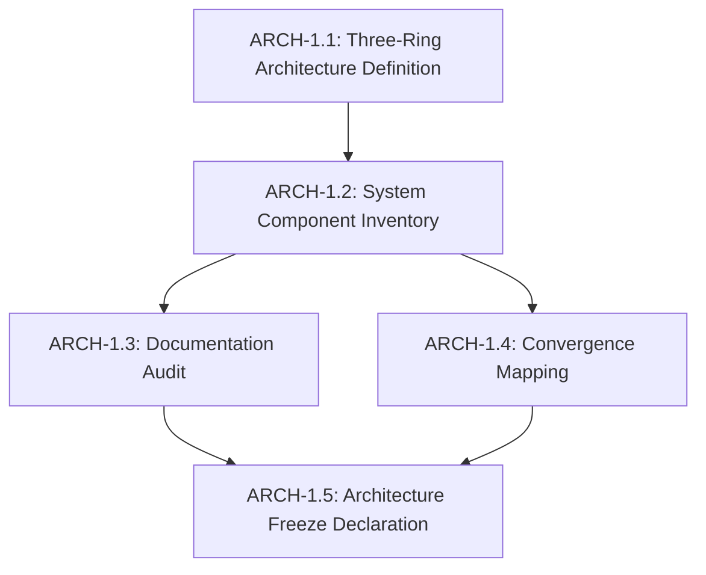

# Task Graph: Architecture Landscape & Freeze

**Status**: ACTIVE
**Parent Graph**: `docs/epistemic/roadmap/task_graph.md` (if exists) or Independent
**Focus**: System Architecture & Documentation

---

## Task Graph

## Task Details

### ARCH-1.1: Three-Ring Architecture Definition
- **Type**: Documentation
- **Blocking**: YES
- **Execution**: Manual
- **Description**: Define the immutable rings (Core Research, Adapters, Intelligence) in the foundational DWBS.
- **Status**: COMPLETE

### ARCH-1.2: System Component Inventory
- **Type**: Documentation
- **Blocking**: YES
- **Execution**: Analytical
- **Description**: Map every meaningful component in `src/` and root to the 3-ring architecture. Produce `docs/architecture/system_landscape.md`.
- **Status**: PENDING

### ARCH-1.3: Documentation Audit
- **Type**: Documentation
- **Blocking**: YES
- **Execution**: Manual
- **Description**: Audit all existing documentation files. Classify as Canonical, Merge, Deprecated, or Delete. Produce `docs/architecture/documentation_audit.md`.
- **Status**: PENDING

### ARCH-1.4: Convergence Mapping
- **Type**: Documentation
- **Blocking**: YES
- **Execution**: Analytical
- **Description**: Define how legacy and future components (like India logic) converge into the new architecture. Produce `docs/architecture/convergence_map.md`.
- **Status**: PENDING

### ARCH-1.5: Architecture Freeze Declaration
- **Type**: Governance
- **Blocking**: NO
- **Execution**: Manual
- **Description**: Declare the freeze, update obligations, and ensure no code is touched.
- **Status**: PENDING
