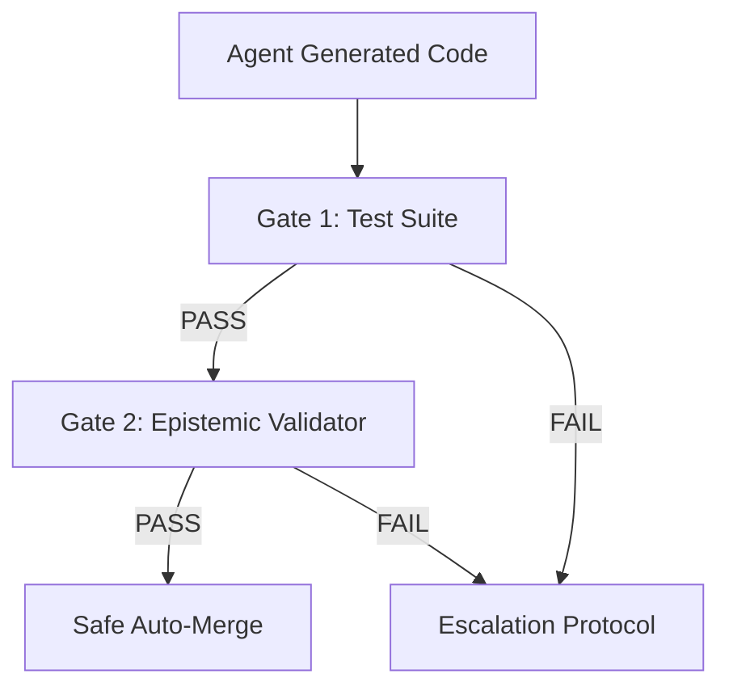

# Automation Agent Trust Boundary & Security Policy

**Version:** 1.0.0  
**Status:** AUTHORITATIVE  
**Applicability:** Jules, Gemini, and all Autonomous Optimization Loops  

---

> [!IMPORTANT]
> To prevent autonomous code generation from causing architectural drift, violating regulatory boundaries, or introducing security compromises, this document defines the absolute operational boundary of all automated engineering loops.

---

## 1. Allowed Write Scopes

Automation agents are permitted to make modifications ONLY within the following designated paths:

- **Source Components:** `src/` (Except `src/portfolio_intelligence/connectors/` which requires manual audit).
- **Test Suites:** `tests/`, `paper_trading/execution/tests/`, `research_modules/*/tests/`.
- **Pipeline Configurations:** `config/pipeline/` (Adhering to strict DAG validations).
- **Research Sandboxes:** `research_modules/` (Only in Phase 6+ and within private file structures).

---

## 2. Forbidden Areas & Scopes

Under no circumstances may any automation agent write to, overwrite, or delete content within:

1. **Security & Credentials:**
   - `.env` and `.env.example` files.
   - Any secret management configs or `.runtime/mcp_sessions.json`.
2. **Governance & Safety Policies:**
   - `docs/governance/` (This folder, including all trust boundaries and matrices).
   - `scripts/epistemic_validator.py` (The validator itself cannot be modified by agents).
   - `docs/memory/01_vision/`, `docs/memory/02_success/`, and `docs/memory/03_domain/`.
3. **Core Version Control:**
   - `.git/` folder and git workflow hooks.
   - GitHub Actions workflow yaml files under `.github/workflows/`.

---

## 3. Merge & Readiness Checks (The Automated Gates)

Before any agent-generated code can be merged into the default tracking branch, it must pass a mandatory double-gated validation check:

### 3.1 Gate 1: Test Verification
- Run `python -m pytest` across all active modules.
- **Requirement:** 100% passing tests. No regressions or silent suppressions allowed.

### 3.2 Gate 2: Epistemic Validator
- Run `python scripts/epistemic_validator.py`.
- **Requirement:** Absolute pass across all 5 verification dimensions:
  1. `README.md` authority and active recovery DWBS references.
  2. Phase-lock import boundaries (no forbidden imports in lower phases).
  3. Daily pipeline defaults to `fixture` mode.
  4. Operational safety constraints (no write APIs in research/paper folders).
  5. No hardcoded secrets or API tokens.

---

## 4. Escalation Protocol

If an automation agent violates these boundaries or fails validation, the system triggers the following escalation protocol based on gravity:

| Level | Severity | Trigger | Action Taken |
| :--- | :--- | :--- | :--- |
| **Level 1 (Warn)** | Low | Single test/epistemic failure on agent check-in. | Agent receives feedback and enters a self-correction loop (max 3 retries). |
| **Level 2 (Pause)** | Medium | Repeat failure loop (> 3 attempts) or attempts to touch draft component specifications without prior approval. | Execution halts. Agent generates a diff report and waits for manual developer review. |
| **Level 3 (Lockdown)** | High | Attempted modification of forbidden paths, deletion of database assets, or execution of forbidden APIs (e.g. placing live orders). | Immediate loop termination. Local files are locked in read-only state. Alerts are sent to Admin, and the environment requires manual reset. |

---
*Signed,*  
**Chief Security & Automation Officer**  
*TraderFund Architecture Committee*
