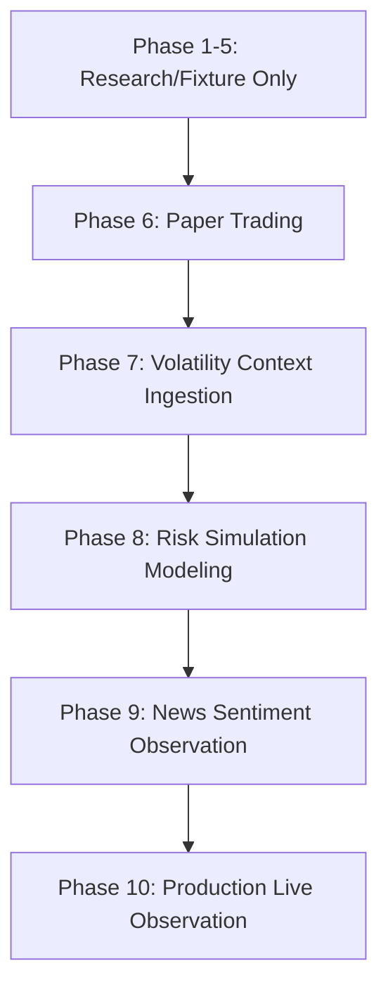
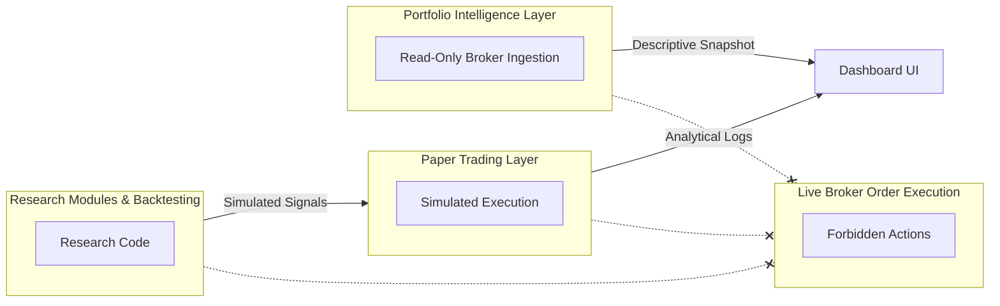

# Operational Boundaries & Safety Document

**Version:** 1.0.0  
**Status:** AUTHORITATIVE  
**Applicability:** ALL MODULES  

---

> [!IMPORTANT]
> This document defines the absolute structural boundaries of the TraderFund system. Adherence to these boundaries is verified by execution constraints and static repositories checks. Under no circumstances may write permission or live trading pathways be introduced to any module outside of these strict boundaries.

---

## 1. System Execution Phases

The TraderFund platform adheres to a strict multi-phase lifecycle to separate experimental research from live operations.

### 1.1 Phase Classification Matrix

| Phase | Category | Allowed Operations | Forbidden Operations | Credentials |
| :--- | :--- | :--- | :--- | :--- |
| **Phases 1-5** | Research & Fixture | Pure historical analysis, local math validation, local artifact writing (`data/processed/`, `logs/validation/`). | Any network request, any broker API call, any live data pull. | NONE. |
| **Phase 6** | Paper Trading | Momentum signal consumption, slippage simulation, local trade logging. | Live broker connection, any real capital allocation. | Simulated/Mock accounts only. |
| **Phase 7** | Volatility Context | Volatility metric extraction, historical ATR regime labeling. | Live trading execution, automatic regime adjustments. | None (Public API/Historical). |
| **Phase 8** | Risk Simulator | position sizing simulation, historical black-swan stress testing. | Real portfolio sizing override, capital mutation. | Simulation parameters. |
| **Phase 9** | News Sentiment | News ingestion, sentiment observation, social media indexing. | Live trade halts, direct pipeline blocking. | Public RSS/Aggregator API keys. |
| **Phase 10** | Live Observation | Read-only broker fetches (Zerodha/Kite), portfolio exposure calculation. | Order execution, writing to broker, changing portfolio balances. | Read-Only API Keys / MCP Tokens. |

---

## 2. Trust Boundaries

### 2.1 Research & Backtesting Boundary
- **Allowed:** Reading from raw/processed data paths, performing complex mathematical models (Kelly Criterion, Volatility regimes), writing analysis snapshots to local JSON/CSV under `research_modules/`.
- **Forbidden:** Access to `traderfund.portfolio` or any direct write pipeline. No ability to trigger order requests.

### 2.2 Paper Trading Boundary
- **Allowed:** Consuming signals generated by the Momentum Engine, processing slippage/fee models, saving simulation logs under `paper_trading/logs/`.
- **Forbidden:** Under no circumstances does the Paper Trading layer contain SDKs or authentication materials for placing orders on NSE, BSE, NYSE, or any other live exchanges.

### 2.3 Portfolio Intelligence Boundary (Zerodha Ingestion)
- **Allowed:** Authenticating using `KITE_API_KEY` + `KITE_ACCESS_TOKEN` in order to fetch holdings, positions, and orders. Creating localized analytical snapshots.
- **Forbidden:** No transaction or execution capability. The connector implements `fetch_holdings`, `fetch_positions`, `fetch_orders`, and `fetch_instruments` but has **no** `place_order`, `modify_order`, or `cancel_order` functions. It is technically impossible for this subsystem to modify the state of the broker.

---

## 3. Credential Management & Fallback Policies

1. **Isolation of Credentials:**
   - Real-world broker credentials (`KITE_API_KEY`, `KITE_ACCESS_TOKEN`, `KITE_API_SECRET`) must be supplied exclusively through system environment variables or secure local files.
   - Credentials must **never** be hardcoded or written to git tracking files.
   - If credentials are not present, the Portfolio subsystem must fail-closed honestly, logging a distinct `MissingBrokerCredentialsError` and rendering a clean `CONNECTIVITY_ERROR` on the dashboard, rather than attempting to bypass safety blocks.

2. **API Fallback Design:**
   - The primary connectivity method is the **Kite MCP Server**.
   - If Kite MCP connectivity is lost, the connector safely falls back to standard HTTP/REST requests using standard Kite Connect API protocol boundaries.
   - Fallbacks must preserve read-only constraints at all times.

---

## 4. Operational Invariants

To guarantee safety under all future automation loops (e.g. Jules or other LLM-based autonomous agents), the following system-wide invariants are declared:

- **INV-NO-EXECUTION:** The codebase contains no execution or order placement APIs. Any PR attempting to add broker-side writes will be blocked.
- **INV-NO-CAPITAL:** The system cannot initiate fund transfers or modify live capital accounts.
- **INV-NO-SELF-ACTIVATION:** Automation agents cannot transition the system to higher active phases without manual architectural sign-off.
- **INV-PROXY-CANONICAL:** Broad market indices (SPY, NIFTY) are the only canonical regime proxies. Individual stocks cannot override broad indices.

---
*Signed,*  
**Senior Architect & Security Officer**  
*TraderFund Governance Board*
