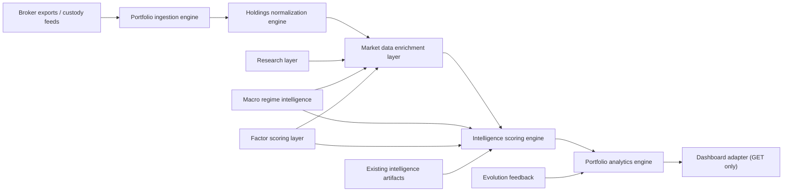

# Portfolio Intelligence Subsystem Architecture

- Status: `DESIGN / DRY_RUN`
- Date: `2026-03-11`
- Truth epoch: `TRUTH_EPOCH_2026-03-06_01` (frozen)
- Data mode: `REAL_ONLY`
- Markets: `US`, `INDIA`
- Layers affected: `RESEARCH`, `MACRO`, `FACTOR`, `INTELLIGENCE`, `EVOLUTION`, `DASHBOARD`

## 1. Purpose

TraderFund already has an L9 portfolio intelligence engine in [src/layers/portfolio_intelligence.py](/C:/GIT/TraderFund/src/layers/portfolio_intelligence.py) that diagnoses structural issues in the system's own portfolio state. This design extends that surface to a separate, user-portfolio subsystem for broker-held portfolios without changing the existing L9 engine's runtime behavior.

The new subsystem is a read-only analytical plane that:

- ingests holdings from multiple broker sources
- normalizes them into a canonical schema
- enriches them with market, research, macro, factor, and event context
- produces holding-level and portfolio-level intelligence
- exposes results to the dashboard through GET-only contracts

The subsystem does not:

- execute trades
- size capital
- activate strategies
- write back into upstream research, macro, factor, or evolution layers

## 2. Governance Envelope

The subsystem is constrained by the following invariants:

- `INV-NO-EXECUTION`
- `INV-NO-CAPITAL`
- `INV-NO-SELF-ACTIVATION`
- `INV-PROXY-CANONICAL`
- `INV-READ-ONLY-DASHBOARD`

The subsystem must satisfy the following obligations on every output:

- `OBL-DATA-PROVENANCE-VISIBLE`
- `OBL-TRUTH-EPOCH-DISCLOSED`
- `OBL-REGIME-GATE-EXPLICIT`
- `OBL-MARKET-PARITY`
- `OBL-HONEST-STAGNATION`

Practical enforcement:

- every output includes `truth_epoch`, `trace`, and `data_as_of`
- every confidence-bearing result shows whether regime context is `COMPLETE`, `DEGRADED`, or `BLOCKED`
- stale or missing inputs degrade coverage instead of being hidden
- dashboard access is GET-only and observer-only

## 3. Subsystem Boundary

The subsystem sits beside the existing L9 engine, not inside the execution path.



Boundary rules:

- upstream layers are inputs only
- dashboard is a consumer only
- no portfolio intelligence output is allowed to become an execution instruction

## 4. Canonical Domain Model

The analytical path uses four progressively richer contracts.

### 4.1 Portfolio Source Record

Represents a broker-specific import event.

Required fields:

- `portfolio_id`
- `market`
- `broker`
- `import_id`
- `source_checksum`
- `imported_at`
- `raw_holdings`

### 4.2 Normalized Holding

Represents the canonical cross-broker position schema.

Required fields:

- `symbol`
- `market`
- `portfolio_id`
- `broker`
- `quantity`
- `cost_basis`
- `last_price`
- `market_value`
- `unrealized_pnl`
- `unrealized_pnl_pct`
- `weight_pct`
- `sector`
- `industry`
- `geography`
- `currency`
- `data_provenance`

### 4.3 Holding Intelligence Card

Represents per-position institutional diagnostics.

Required lenses:

- fundamentals: `pe_ratio`, `earnings_growth`, `revenue_growth`, `margins`, `balance_sheet_health`
- technicals: `trend_regime`, `momentum`, `volatility_regime`, `support_resistance`
- factor exposure: `growth`, `value`, `momentum`, `quality`, `macro_sensitivity`
- sentiment: `news_flow`, `major_catalysts`, `earnings_events`
- summary: `opportunity_classification`, `risk_flags`, `conviction_score`, `regime_compatibility`

### 4.4 Portfolio Analysis Bundle

Represents the portfolio-level analytical output.

Required reports:

- diversification
- risk diagnostics
- structure analysis
- performance analytics
- strategic insights
- resilience score

## 5. Component Architecture

| Component | Responsibility | Inputs | Outputs | Degraded behavior |
| --- | --- | --- | --- | --- |
| Portfolio ingestion engine | Parse broker exports and register portfolios | broker export, market scope, portfolio metadata | raw holdings, import audit | reject malformed import and surface provenance gap |
| Holdings normalization engine | Canonicalize positions and compute weights | raw holdings, ticker map, sector taxonomy | normalized holdings | emit `UNKNOWN` classifications with flags |
| Market data enrichment layer | Attach prices, fundamentals, technicals, events, freshness | normalized holdings, canonical data stores, truth epoch | enriched holdings, staleness report | preserve partial data and reduce confidence |
| Intelligence scoring engine | Produce holding-level diagnostics | enriched holdings, macro context, factor context, research context | holding intelligence cards, risk flags, regime compatibility | cap conviction and emit insufficient-context flags |
| Portfolio analytics engine | Produce diversification, risk, structure, performance, insights | intelligence cards, portfolio metadata, evolution feedback | portfolio diagnostics, resilience score, strategic insights | return partial analytics with honest stagnation |
| Dashboard adapter | Publish read-only payloads | analytics bundle, intelligence cards, truth epoch | overview, holdings, combined-market payloads | GET-only degraded payload with traceable reason |

## 6. Integration with Existing TraderFund Layers

### 6.1 Research

Consumed for:

- issuer metadata
- sector and industry taxonomy
- fundamental coverage
- research freshness

Constraint:

- no write-back into research modules

### 6.2 Macro

Consumed for:

- regime state
- regime confidence
- rate environment
- macro provenance and staleness

Constraint:

- regime compatibility must be explicit on each holding card and each portfolio summary

### 6.3 Factor

Consumed for:

- dominant factor context
- per-symbol factor exposure state
- factor permission metadata

Constraint:

- factor context informs diagnostics only; it must not rank or authorize holdings

### 6.4 Intelligence

Consumed for:

- canonical decision policy
- fragility posture
- suppression state
- truth epoch and system posture

Constraint:

- portfolio intelligence must inherit canonical provenance and stale-state disclosure

### 6.5 Evolution

Consumed for:

- paper portfolio feedback
- historical evaluation context
- comparative structural diagnostics

Constraint:

- user portfolio analytics may compare against evolution context but may not mutate it

### 6.6 Dashboard

Consumed by:

- FastAPI backend loaders and routes
- frontend portfolio module

Constraint:

- no POST, PUT, DELETE, or import-triggering UI in this surface

## 7. Regime Gate Policy

The subsystem has an explicit regime gate because holding conviction without macro context would violate the governance envelope.

Gate states:

- `COMPLETE`: current macro regime, confidence, and freshness available
- `DEGRADED`: regime available but stale, partial, or low-confidence
- `BLOCKED`: regime unavailable or non-canonical

Rules:

- `COMPLETE` allows full conviction computation
- `DEGRADED` allows analysis, but conviction is capped and results are labeled degraded
- `BLOCKED` allows only descriptive reporting; no regime compatibility score is produced

## 8. Portfolio-Level Analytics

The analytics layer must produce these portfolio diagnostics.

### 8.1 Diversification

- sector concentration
- geography exposure
- factor concentration
- effective positions count

### 8.2 Risk Diagnostics

- drawdown sensitivity
- macro exposure
- correlation clustering
- single-position impact concentration

### 8.3 Portfolio Structure

- core versus satellite holdings
- concentration risk
- overweight versus underweight baseline analysis

### 8.4 Performance

- unrealized gains and losses
- winners versus laggards
- contribution to portfolio return

### 8.5 Strategic Insights

Allowed insight categories:

- diversification gaps
- factor imbalance
- macro regime vulnerability
- hidden concentration risk
- positions requiring review
- holdings aligned with regime
- holdings with deteriorating fundamentals
- holdings with improving momentum

Language rule:

- observational only
- no imperative trade verbs
- no allocation or execution language

## 9. Storage and Artifact Layout

Proposed dry-run layout:

```text
data/portfolio_intelligence/
  imports/{market}/
  normalized/{market}/
  enriched/{market}/
  intelligence/{market}/
  analytics/{market}/
  registry/portfolio_registry.json
```

Each materialized artifact should include:

- `truth_epoch`
- `trace`
- `data_as_of`
- `input_hash`
- `computed_at`
- `market`
- `portfolio_id` when portfolio-scoped

## 10. Dashboard Contract

The dashboard adapter remains read-only and exposes only GET endpoints.

| Endpoint | Purpose |
| --- | --- |
| `GET /api/portfolio/overview/{market}` | market-scoped portfolio summaries |
| `GET /api/portfolio/holdings/{market}/{portfolio_id}` | holding intelligence cards |
| `GET /api/portfolio/diversification/{market}/{portfolio_id}` | diversification analysis |
| `GET /api/portfolio/risk/{market}/{portfolio_id}` | risk diagnostics |
| `GET /api/portfolio/structure/{market}/{portfolio_id}` | structure analysis |
| `GET /api/portfolio/performance/{market}/{portfolio_id}` | performance analytics |
| `GET /api/portfolio/insights/{market}/{portfolio_id}` | strategic insights |
| `GET /api/portfolio/resilience/{market}/{portfolio_id}` | resilience score |
| `GET /api/portfolio/combined` | US plus INDIA combined exposure view |

Combined-market requirements:

- explicit FX provenance
- explicit currency normalization method
- explicit stale-rate warning if FX is not current

## 11. Failure and Degraded Modes

| Condition | Response |
| --- | --- |
| broker file malformed | reject import and record checksum plus parsing error |
| symbol unmapped | retain raw symbol, mark holding unresolved, exclude from confidence-bearing scores |
| sector unavailable | assign `UNKNOWN` and surface classification flag |
| fundamentals missing | compute technical and structural analytics only, mark holding partial |
| macro context stale | downgrade regime compatibility and resilience confidence |
| factor context unavailable | omit factor concentration and surface degraded portfolio diagnostic |
| FX unavailable for combined view | block combined resilience score and show only local-currency slices |

## 12. Extensibility

The design keeps the contracts market-parameterized so the same analytical path can later absorb:

- crypto portfolios
- derivatives exposure
- options strategies
- cross-portfolio optimization
- institutional risk models

Those future additions must preserve the same invariant envelope: no execution, no capital, no self-activation, no write-enabled dashboard.

## 13. Current Integration Output

This design is represented in code by the dry-run blueprint bridge in [src/layers/portfolio_intelligence.py](/C:/GIT/TraderFund/src/layers/portfolio_intelligence.py), via `PortfolioIntelligenceDesignBridge` and `build_portfolio_intelligence_blueprint()`.

That bridge:

- leaves the current L9 engine unchanged
- publishes the governed subsystem shape
- gives the dashboard and future implementation work a single deterministic contract
