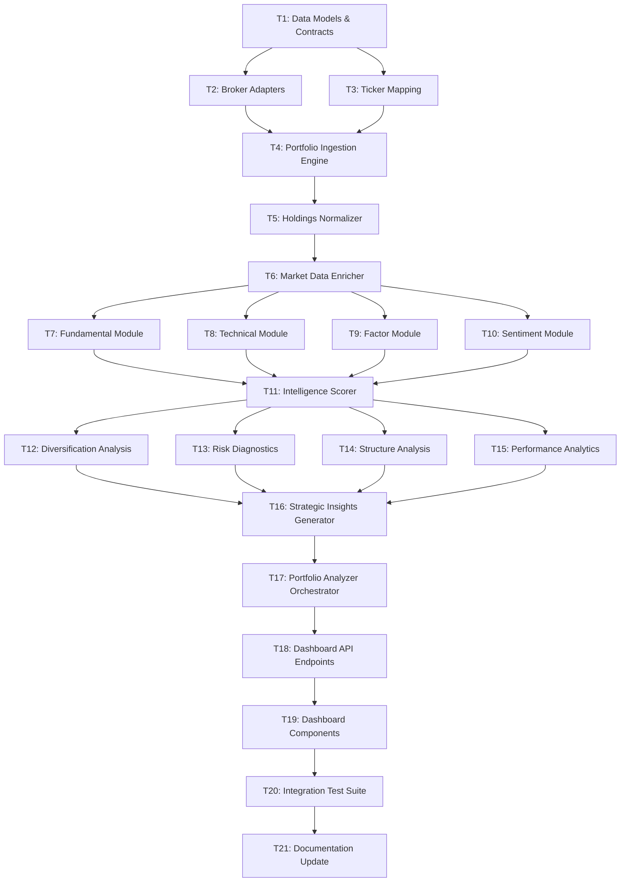

# Portfolio Intelligence Subsystem — Implementation Task Graph

**Version**: 1.0.0  
**Status**: DESIGN (DRY_RUN)  
**Author**: Governed Execution — ChatGPT → Antigravity  
**Truth Epoch**: `TRUTH_EPOCH_2026-03-06_01` (FROZEN)  
**Scope**: US, INDIA  
**Date**: 2026-03-08

---

## Task Graph Overview

This document defines the deterministic build sequence for the Portfolio Intelligence Subsystem (PIS).  
All tasks follow the **Design/Build Harness** discipline: Architecture → Logic → Execution.

### Dependency Chain



---

## Phase 1: Foundation (T1 – T3)

### T1: Data Models & Contracts

| Field | Value |
|-------|-------|
| **ID** | `PIS-T1` |
| **Layer** | ARCHITECTURE |
| **Priority** | P0 (Critical Path) |
| **Dependencies** | None |
| **Estimated Effort** | 3 hours |
| **Output** | `src/portfolio_intelligence/models/*.py`, `src/portfolio_intelligence/contracts/*.py` |

**Description**: Define all frozen dataclass contracts for the subsystem. These are the canonical schemas that every downstream component will consume.

**Subtasks**:

| # | Task | File | Status |
|---|------|------|--------|
| 1.1 | Create `ingestion_models.py` — `RawPortfolioImport`, `RawHolding`, `PortfolioRegistry`, `PortfolioMeta` | `src/portfolio_intelligence/models/ingestion_models.py` | ⬜ |
| 1.2 | Create `holding_models.py` — `NormalizedHolding`, `DataProvenance` | `src/portfolio_intelligence/models/holding_models.py` | ⬜ |
| 1.3 | Create `intelligence_models.py` — `HoldingIntelligenceCard`, `HoldingFactorExposure`, `HoldingSentiment`, `FundamentalMetrics`, `TechnicalMetrics` | `src/portfolio_intelligence/models/intelligence_models.py` | ⬜ |
| 1.4 | Create `analytics_models.py` — `DiversificationReport`, `RiskDiagnosticReport`, `StructureReport`, `PerformanceReport`, `StrategicInsight`, `PortfolioResilienceScore`, `CombinedPortfolioView` | `src/portfolio_intelligence/models/analytics_models.py` | ⬜ |
| 1.5 | Create `api_contracts.py` — API response schemas for dashboard endpoints | `src/portfolio_intelligence/contracts/api_contracts.py` | ⬜ |
| 1.6 | Create `__init__.py` files with FORBIDDEN OPERATIONS comment block | All `__init__.py` | ⬜ |

**Acceptance Criteria**:
- All models are `@dataclass(frozen=True)`
- All models have type hints and docstrings
- No model contains execution or capital logic
- Models import cleanly with zero circular dependencies

---

### T2: Broker Adapters

| Field | Value |
|-------|-------|
| **ID** | `PIS-T2` |
| **Layer** | LOGIC |
| **Priority** | P0 |
| **Dependencies** | T1 |
| **Estimated Effort** | 4 hours |
| **Output** | `src/portfolio_intelligence/ingestion/broker_adapters/*.py` |

**Description**: Implement broker-specific CSV/file parsers that transform raw broker exports into `RawHolding` objects.

**Subtasks**:

| # | Task | File | Status |
|---|------|------|--------|
| 2.1 | Create `base_adapter.py` — Abstract `BrokerAdapter` with `parse(file_path) → List[RawHolding]` | `broker_adapters/base_adapter.py` | ⬜ |
| 2.2 | Implement `zerodha_adapter.py` — Parse Zerodha Holdings CSV (INDIA) | `broker_adapters/zerodha_adapter.py` | ⬜ |
| 2.3 | Implement `groww_adapter.py` — Parse Groww Holdings CSV (INDIA) | `broker_adapters/groww_adapter.py` | ⬜ |
| 2.4 | Implement `ibkr_adapter.py` — Parse IBKR Flex Query CSV (US) | `broker_adapters/ibkr_adapter.py` | ⬜ |
| 2.5 | Implement `schwab_adapter.py` — Parse Schwab Positions CSV (US) | `broker_adapters/schwab_adapter.py` | ⬜ |
| 2.6 | Create adapter tests with sample CSV fixtures | `tests/portfolio_intelligence/test_broker_adapters.py` | ⬜ |

**Acceptance Criteria**:
- Each adapter produces valid `RawHolding` tuples
- Adapters handle malformed CSVs gracefully (log + skip invalid rows)
- Tests include sample fixtures for each broker format

---

### T3: Ticker Mapping

| Field | Value |
|-------|-------|
| **ID** | `PIS-T3` |
| **Layer** | LOGIC |
| **Priority** | P0 |
| **Dependencies** | T1 |
| **Estimated Effort** | 2 hours |
| **Output** | `src/portfolio_intelligence/ingestion/ticker_mapping.py` |

**Description**: Build a cross-broker ticker resolution engine.

**Subtasks**:

| # | Task | File | Status |
|---|------|------|--------|
| 3.1 | Create ticker mapping registry (broker_ticker → canonical_ticker) | `ticker_mapping.py` | ⬜ |
| 3.2 | Implement India broker ticker resolution (Zerodha NSE → canonical NSE) | Same | ⬜ |
| 3.3 | Implement US ticker normalization (strip exchange suffix, validate) | Same | ⬜ |
| 3.4 | Implement ISIN-based fallback resolution | Same | ⬜ |
| 3.5 | Create mapping tests | `tests/portfolio_intelligence/test_ticker_mapping.py` | ⬜ |

**Acceptance Criteria**:
- `RELIANCE` (Zerodha) → `RELIANCE.NS` (canonical)
- `AAPL` (Schwab) → `AAPL` (canonical, no change)
- Unknown tickers produce `UNRESOLVED` status with audit log entry

---

## Phase 2: Ingestion & Normalization (T4 – T5)

### T4: Portfolio Ingestion Engine

| Field | Value |
|-------|-------|
| **ID** | `PIS-T4` |
| **Layer** | LOGIC |
| **Priority** | P0 |
| **Dependencies** | T2, T3 |
| **Estimated Effort** | 3 hours |
| **Output** | `src/portfolio_intelligence/ingestion/portfolio_ingester.py` |

**Description**: Master ingestion orchestrator that coordinates broker adapters, ticker mapping, and portfolio registry.

**Subtasks**:

| # | Task | File | Status |
|---|------|------|--------|
| 4.1 | Implement `PortfolioIngester.ingest(file_path, broker, market, portfolio_id)` | `portfolio_ingester.py` | ⬜ |
| 4.2 | Implement duplicate detection (file checksum comparison) | Same | ⬜ |
| 4.3 | Implement portfolio registry management (create/update portfolio metadata) | Same | ⬜ |
| 4.4 | Implement raw import persistence to `data/portfolio_intelligence/imports/` | Same | ⬜ |
| 4.5 | Write integration tests | `tests/portfolio_intelligence/test_ingestion.py` | ⬜ |

**Acceptance Criteria**:
- Imports are append-only with unique `import_id`
- Duplicate file detection prevents re-ingestion
- Portfolio registry is updated atomically
- All operations are logged with data provenance

---

### T5: Holdings Normalization Engine

| Field | Value |
|-------|-------|
| **ID** | `PIS-T5` |
| **Layer** | LOGIC |
| **Priority** | P0 |
| **Dependencies** | T4 |
| **Estimated Effort** | 3 hours |
| **Output** | `src/portfolio_intelligence/normalization/holdings_normalizer.py`, `sector_classifier.py` |

**Description**: Transform raw holdings into canonical `NormalizedHolding` objects.

**Subtasks**:

| # | Task | File | Status |
|---|------|------|--------|
| 5.1 | Implement `HoldingsNormalizer.normalize(raw_holdings, market)` | `holdings_normalizer.py` | ⬜ |
| 5.2 | Implement weight computation (per-holding as % of total portfolio value) | Same | ⬜ |
| 5.3 | Implement `SectorClassifier` — GICS classification for US, NSE classification for India | `sector_classifier.py` | ⬜ |
| 5.4 | Create sector mapping reference data files | `data/portfolio_intelligence/reference/` | ⬜ |
| 5.5 | Persist normalized holdings to `data/portfolio_intelligence/normalized/` | Same | ⬜ |
| 5.6 | Write normalization tests | `tests/portfolio_intelligence/test_normalization.py` | ⬜ |

**Acceptance Criteria**:
- All holdings have `weight_pct` summing to 100.0 (±0.01 tolerance)
- All holdings have sector/industry classification
- Unclassifiable holdings receive `UNKNOWN` sector with audit flag

---

## Phase 3: Enrichment (T6)

### T6: Market Data Enrichment Layer

| Field | Value |
|-------|-------|
| **ID** | `PIS-T6` |
| **Layer** | LOGIC |
| **Priority** | P1 |
| **Dependencies** | T5 |
| **Estimated Effort** | 4 hours |
| **Output** | `src/portfolio_intelligence/enrichment/market_data_enricher.py`, `technical_enricher.py`, `provenance_tracker.py` |

**Description**: Enrich normalized holdings with latest prices, fundamentals, and technical indicators from existing TraderFund data stores.

**Subtasks**:

| # | Task | File | Status |
|---|------|------|--------|
| 6.1 | Implement `MarketDataEnricher.enrich(holdings, market)` — orchestrator | `market_data_enricher.py` | ⬜ |
| 6.2 | Implement price fill from `data/analytics/us/prices/daily/` (US) | Same | ⬜ |
| 6.3 | Implement price fill from NSE EOD data (India) | Same | ⬜ |
| 6.4 | Implement `TechnicalEnricher` — compute RSI, MACD, SMA, ATR, BB via pandas-ta | `technical_enricher.py` | ⬜ |
| 6.5 | Implement `ProvenanceTracker` — data freshness monitoring with staleness alerts | `provenance_tracker.py` | ⬜ |
| 6.6 | Integration with existing `src/layers/macro_layer.py` (read-only regime context) | `market_data_enricher.py` | ⬜ |
| 6.7 | Integration with existing `src/layers/factor_live.py` (read-only factor state) | Same | ⬜ |
| 6.8 | Write enrichment tests | `tests/portfolio_intelligence/test_enrichment.py` | ⬜ |

**Acceptance Criteria**:
- Every enriched holding carries `DataProvenance` with source + staleness
- Zero writes to existing data stores (read-only access)
- Stale data (> 48h) produces `DEGRADED` confidence, documented but not hidden

---

## Phase 4: Intelligence Scoring (T7 – T11)

### T7: Fundamental Module

| Field | Value |
|-------|-------|
| **ID** | `PIS-T7` |
| **Layer** | LOGIC |
| **Priority** | P1 |
| **Dependencies** | T6 |
| **Estimated Effort** | 3 hours |
| **Output** | `src/portfolio_intelligence/scoring/fundamental_module.py` |

**Subtasks**:

| # | Task | Status |
|---|------|--------|
| 7.1 | Implement PE ratio computation | ⬜ |
| 7.2 | Implement earnings/revenue growth computation | ⬜ |
| 7.3 | Implement margin analysis (gross, operating, net) | ⬜ |
| 7.4 | Implement balance sheet health scoring (D/E, current ratio) | ⬜ |
| 7.5 | Implement composite fundamental health score [0.0 – 1.0] | ⬜ |
| 7.6 | Implement fundamental classification (STRONG → DISTRESSED) | ⬜ |
| 7.7 | Write tests with known financial data fixtures | ⬜ |

**Acceptance Criteria**:
- Score is deterministic for identical inputs
- Missing data produces explicit `INSUFFICIENT_DATA` flag
- Score range is [0.0, 1.0] with no NaN outputs

---

### T8: Technical Module

| Field | Value |
|-------|-------|
| **ID** | `PIS-T8` |
| **Layer** | LOGIC |
| **Priority** | P1 |
| **Dependencies** | T6 |
| **Estimated Effort** | 2 hours |
| **Output** | `src/portfolio_intelligence/scoring/technical_module.py` |

**Subtasks**:

| # | Task | Status |
|---|------|--------|
| 8.1 | Implement trend regime classification from SMA/EMA/ADX | ⬜ |
| 8.2 | Implement momentum score from RSI/MACD/ROC | ⬜ |
| 8.3 | Implement volatility regime from ATR/BB width | ⬜ |
| 8.4 | Implement support/resistance detection | ⬜ |
| 8.5 | Wire to existing `data/analytics/us/indicators/` | ⬜ |
| 8.6 | Write tests | ⬜ |

---

### T9: Factor Exposure Module

| Field | Value |
|-------|-------|
| **ID** | `PIS-T9` |
| **Layer** | LOGIC |
| **Priority** | P1 |
| **Dependencies** | T6 |
| **Estimated Effort** | 2 hours |
| **Output** | `src/portfolio_intelligence/scoring/factor_module.py` |

**Subtasks**:

| # | Task | Status |
|---|------|--------|
| 9.1 | Implement per-holding factor scoring (growth, value, momentum, quality, macro sens.) | ⬜ |
| 9.2 | Implement dominant factor detection | ⬜ |
| 9.3 | Implement factor alignment vs portfolio-level dominant factor | ⬜ |
| 9.4 | Read from `src/layers/factor_live.py` for factor context comparison | ⬜ |
| 9.5 | Write tests | ⬜ |

---

### T10: Sentiment Module

| Field | Value |
|-------|-------|
| **ID** | `PIS-T10` |
| **Layer** | LOGIC |
| **Priority** | P2 |
| **Dependencies** | T6 |
| **Estimated Effort** | 3 hours |
| **Output** | `src/portfolio_intelligence/scoring/sentiment_module.py` |

**Subtasks**:

| # | Task | Status |
|---|------|--------|
| 10.1 | Implement news flow intensity aggregation | ⬜ |
| 10.2 | Implement sentiment polarity scoring | ⬜ |
| 10.3 | Implement catalyst detection (earnings dates, major events) | ⬜ |
| 10.4 | Implement analyst consensus tracking | ⬜ |
| 10.5 | Create sentiment data adapters (news API integration) | ⬜ |
| 10.6 | Write tests | ⬜ |

---

### T11: Intelligence Scorer Orchestrator

| Field | Value |
|-------|-------|
| **ID** | `PIS-T11` |
| **Layer** | LOGIC |
| **Priority** | P1 |
| **Dependencies** | T7, T8, T9, T10 |
| **Estimated Effort** | 2 hours |
| **Output** | `src/portfolio_intelligence/scoring/intelligence_scorer.py` |

**Subtasks**:

| # | Task | Status |
|---|------|--------|
| 11.1 | Implement `IntelligenceScorer.score_holding(normalized_holding, enriched_data)` | ⬜ |
| 11.2 | Implement conviction score computation (weighted composite) | ⬜ |
| 11.3 | Implement opportunity classification logic | ⬜ |
| 11.4 | Implement risk flag generation | ⬜ |
| 11.5 | Implement regime compatibility check (vs L1 regime state) | ⬜ |
| 11.6 | Implement `score_portfolio(holdings, market)` — batch scorer | ⬜ |
| 11.7 | Persist `HoldingIntelligenceCard` to `data/portfolio_intelligence/intelligence/` | ⬜ |
| 11.8 | Write integration tests | ⬜ |

**Acceptance Criteria**:
- Conviction score = `0.30 × fundamental + 0.25 × technical + 0.25 × factor + 0.20 × sentiment`
- Opportunity classification is deterministic
- Output includes ISA-8601 timestamp and truth epoch

---

## Phase 5: Portfolio Analytics (T12 – T17)

### T12: Diversification Analysis

| Field | Value |
|-------|-------|
| **ID** | `PIS-T12` |
| **Layer** | LOGIC |
| **Priority** | P1 |
| **Dependencies** | T11 |
| **Estimated Effort** | 2 hours |
| **Output** | `src/portfolio_intelligence/analytics/diversification.py` |

**Subtasks**:

| # | Task | Status |
|---|------|--------|
| 12.1 | Implement sector breakdown computation (weight by sector) | ⬜ |
| 12.2 | Implement HHI computation for sector concentration | ⬜ |
| 12.3 | Implement geography exposure breakdown | ⬜ |
| 12.4 | Implement factor concentration analysis | ⬜ |
| 12.5 | Implement effective positions count (1/HHI) | ⬜ |
| 12.6 | Write tests with known diversified and concentrated portfolios | ⬜ |

---

### T13: Risk Diagnostics

| Field | Value |
|-------|-------|
| **ID** | `PIS-T13` |
| **Layer** | LOGIC |
| **Priority** | P1 |
| **Dependencies** | T11 |
| **Estimated Effort** | 3 hours |
| **Output** | `src/portfolio_intelligence/analytics/risk_diagnostics.py` |

**Subtasks**:

| # | Task | Status |
|---|------|--------|
| 13.1 | Implement drawdown sensitivity scoring | ⬜ |
| 13.2 | Implement single-holding impact analysis | ⬜ |
| 13.3 | Implement macro exposure scoring (read from L1 macro context) | ⬜ |
| 13.4 | Implement correlation clustering (sector-based proxy for Phase 1) | ⬜ |
| 13.5 | Implement composite risk score and classification | ⬜ |
| 13.6 | Write tests | ⬜ |

---

### T14: Portfolio Structure Analysis

| Field | Value |
|-------|-------|
| **ID** | `PIS-T14` |
| **Layer** | LOGIC |
| **Priority** | P2 |
| **Dependencies** | T11 |
| **Estimated Effort** | 2 hours |
| **Output** | `src/portfolio_intelligence/analytics/structure_analysis.py` |

**Subtasks**:

| # | Task | Status |
|---|------|--------|
| 14.1 | Implement core vs satellite classification logic | ⬜ |
| 14.2 | Implement top-N concentration metrics | ⬜ |
| 14.3 | Implement overweight/underweight analysis (vs equal weight baseline) | ⬜ |
| 14.4 | Write tests | ⬜ |

---

### T15: Performance Analytics

| Field | Value |
|-------|-------|
| **ID** | `PIS-T15` |
| **Layer** | LOGIC |
| **Priority** | P1 |
| **Dependencies** | T11 |
| **Estimated Effort** | 2 hours |
| **Output** | `src/portfolio_intelligence/analytics/performance.py` |

**Subtasks**:

| # | Task | Status |
|---|------|--------|
| 15.1 | Implement total PnL and percentage computation | ⬜ |
| 15.2 | Implement winners vs laggards sorting | ⬜ |
| 15.3 | Implement contribution to portfolio return | ⬜ |
| 15.4 | Implement weighted average gain and win rate | ⬜ |
| 15.5 | Write tests with known PnL fixtures | ⬜ |

---

### T16: Strategic Insights Generator

| Field | Value |
|-------|-------|
| **ID** | `PIS-T16` |
| **Layer** | LOGIC |
| **Priority** | P1 |
| **Dependencies** | T12, T13, T14, T15 |
| **Estimated Effort** | 3 hours |
| **Output** | `src/portfolio_intelligence/analytics/strategic_insights.py` |

**Subtasks**:

| # | Task | Status |
|---|------|--------|
| 16.1 | Implement diversification gap detection | ⬜ |
| 16.2 | Implement factor imbalance detection | ⬜ |
| 16.3 | Implement macro regime vulnerability detection | ⬜ |
| 16.4 | Implement hidden concentration risk detection | ⬜ |
| 16.5 | Implement portfolio resilience score computation | ⬜ |
| 16.6 | Implement "positions requiring review" selection | ⬜ |
| 16.7 | Implement "regime-aligned holdings" identification | ⬜ |
| 16.8 | Implement "deteriorating fundamentals" identification | ⬜ |
| 16.9 | Implement "improving momentum" identification | ⬜ |
| 16.10 | Enforce advisory-only language in all output strings | ⬜ |
| 16.11 | Write tests | ⬜ |

---

### T17: Portfolio Analyzer Orchestrator

| Field | Value |
|-------|-------|
| **ID** | `PIS-T17` |
| **Layer** | LOGIC |
| **Priority** | P1 |
| **Dependencies** | T16 |
| **Estimated Effort** | 2 hours |
| **Output** | `src/portfolio_intelligence/analytics/portfolio_analyzer.py` |

**Subtasks**:

| # | Task | Status |
|---|------|--------|
| 17.1 | Implement `PortfolioAnalyzer.analyze(portfolio_id, market)` — master orchestrator | ⬜ |
| 17.2 | Wire all analytics modules (T12–T16) into single analysis pipeline | ⬜ |
| 17.3 | Implement combined cross-market analysis | ⬜ |
| 17.4 | Implement analysis result persistence | ⬜ |
| 17.5 | Write integration tests | ⬜ |

---

## Phase 6: Dashboard Integration (T18 – T19)

### T18: Dashboard API Endpoints

| Field | Value |
|-------|-------|
| **ID** | `PIS-T18` |
| **Layer** | EXECUTION |
| **Priority** | P1 |
| **Dependencies** | T17 |
| **Estimated Effort** | 3 hours |
| **Output** | `src/dashboard/backend/portfolio_api.py` |

**Description**: Register new GET-only API routes in the dashboard backend.

**Subtasks**:

| # | Task | Status |
|---|------|--------|
| 18.1 | Create `portfolio_api.py` with FastAPI router | ⬜ |
| 18.2 | Implement `GET /api/portfolio/overview/{market}` | ⬜ |
| 18.3 | Implement `GET /api/portfolio/holdings/{market}/{portfolio_id}` | ⬜ |
| 18.4 | Implement `GET /api/portfolio/diversification/{market}/{portfolio_id}` | ⬜ |
| 18.5 | Implement `GET /api/portfolio/risk/{market}/{portfolio_id}` | ⬜ |
| 18.6 | Implement `GET /api/portfolio/structure/{market}/{portfolio_id}` | ⬜ |
| 18.7 | Implement `GET /api/portfolio/performance/{market}/{portfolio_id}` | ⬜ |
| 18.8 | Implement `GET /api/portfolio/insights/{market}/{portfolio_id}` | ⬜ |
| 18.9 | Implement `GET /api/portfolio/resilience/{market}/{portfolio_id}` | ⬜ |
| 18.10 | Implement `GET /api/portfolio/combined` | ⬜ |
| 18.11 | Register router in `app.py` | ⬜ |
| 18.12 | Write API tests | ⬜ |

**Acceptance Criteria**:
- All endpoints are GET-only (no POST/PUT/DELETE)
- All responses include `trace` and `truth_epoch` fields
- Error responses follow existing TraderFund API patterns

---

### T19: Dashboard Frontend Components

| Field | Value |
|-------|-------|
| **ID** | `PIS-T19` |
| **Layer** | EXECUTION |
| **Priority** | P1 |
| **Dependencies** | T18 |
| **Estimated Effort** | 6 hours |
| **Output** | `src/dashboard/frontend/src/components/portfolio/` |

**Description**: Create React components for the Portfolio Intelligence dashboard module.

**Subtasks**:

| # | Task | Component | Status |
|---|------|-----------|--------|
| 19.1 | Portfolio Overview Panel — total value, PnL, allocation breakdown | `PortfolioOverview.jsx` | ⬜ |
| 19.2 | Holdings Intelligence Grid — per-stock diagnostics, risk flags, conviction | `HoldingsIntelligenceGrid.jsx` | ⬜ |
| 19.3 | Diversification Visualization — sector sunburst, factor bar, geo map | `DiversificationPanel.jsx` | ⬜ |
| 19.4 | Risk Monitor — risk score gauge, drawdown sensitivity, macro exposure | `RiskMonitor.jsx` | ⬜ |
| 19.5 | Opportunity & Risk Panel — strongest/weakest, concentration alerts | `OpportunityRiskPanel.jsx` | ⬜ |
| 19.6 | Multi-Market View — India/US/Combined portfolio toggle | `MultiMarketView.jsx` | ⬜ |
| 19.7 | Strategic Insights Feed — scrollable insight cards with severity | `StrategicInsightsFeed.jsx` | ⬜ |
| 19.8 | Resilience Score Card — overall score with breakdown | `ResilienceScoreCard.jsx` | ⬜ |
| 19.9 | CSS for all components | `portfolio/*.css` | ⬜ |
| 19.10 | API service functions for portfolio endpoints | `services/portfolioApi.js` | ⬜ |
| 19.11 | Wire components into `App.jsx` as a new dashboard section | `App.jsx` | ⬜ |

**Design Requirements**:
- Follow existing TraderFund dashboard design language (dark theme, severity colors)
- Severity color scheme: INFO=blue, YELLOW=amber, ORANGE=orange, RED=red, CRITICAL=magenta
- All panels show provenance trace and truth epoch
- All panels show data staleness indicator

---

## Phase 7: Validation & Documentation (T20 – T21)

### T20: Integration Test Suite

| Field | Value |
|-------|-------|
| **ID** | `PIS-T20` |
| **Layer** | EXECUTION |
| **Priority** | P1 |
| **Dependencies** | T19 |
| **Estimated Effort** | 4 hours |
| **Output** | `tests/portfolio_intelligence/` |

**Subtasks**:

| # | Task | Status |
|---|------|--------|
| 20.1 | End-to-end test: CSV ingest → normalization → enrichment → scoring → analytics | ⬜ |
| 20.2 | Determinism test: identical inputs → identical outputs (hash comparison) | ⬜ |
| 20.3 | Invariant test: verify no execution/capital/self-activation hooks | ⬜ |
| 20.4 | Market parity test: US and INDIA produce identical schema outputs | ⬜ |
| 20.5 | Latency test: < 2000ms per portfolio evaluation | ⬜ |
| 20.6 | Data staleness test: stale data produces DEGRADED confidence | ⬜ |
| 20.7 | API test: all endpoints return valid JSON with trace | ⬜ |
| 20.8 | Edge case test: empty portfolio, single holding, 100 holdings | ⬜ |

---

### T21: Documentation Update

| Field | Value |
|-------|-------|
| **ID** | `PIS-T21` |
| **Layer** | DOCUMENTATION |
| **Priority** | P2 |
| **Dependencies** | T20 |
| **Estimated Effort** | 2 hours |
| **Output** | Updated docs |

**Subtasks**:

| # | Task | Status |
|---|------|--------|
| 21.1 | Update `docs/ARCHITECTURE_OVERVIEW.md` with PIS subsystem | ⬜ |
| 21.2 | Update `docs/IMPLEMENTATION_STATUS.md` with PIS status | ⬜ |
| 21.3 | Create `docs/portfolio_intelligence/README.md` — subsystem user guide | ⬜ |
| 21.4 | Update `docs/memory/` with PIS component YAML | ⬜ |
| 21.5 | Update governance obligation index | ⬜ |

---

## Effort Summary

| Phase | Tasks | Estimated Hours | Priority |
|-------|-------|----------------|----------|
| Phase 1: Foundation | T1–T3 | 9 | P0 |
| Phase 2: Ingestion/Normalization | T4–T5 | 6 | P0 |
| Phase 3: Enrichment | T6 | 4 | P1 |
| Phase 4: Intelligence Scoring | T7–T11 | 12 | P1 |
| Phase 5: Portfolio Analytics | T12–T17 | 14 | P1 |
| Phase 6: Dashboard Integration | T18–T19 | 9 | P1 |
| Phase 7: Validation/Docs | T20–T21 | 6 | P2 |
| **Total** | **21 tasks** | **~60 hours** | |

---

## Critical Path

```
T1 → T2/T3 → T4 → T5 → T6 → T7/T8/T9/T10 → T11 → T12/T13/T14/T15 → T16 → T17 → T18 → T19 → T20 → T21
```

**Parallelisable segments**:
- T2 and T3 can execute in parallel (after T1)
- T7, T8, T9, T10 can execute in parallel (after T6)
- T12, T13, T14, T15 can execute in parallel (after T11)

---

## Risk Register

| Risk | Likelihood | Impact | Mitigation |
|------|-----------|--------|------------|
| Broker CSV format changes | Medium | Low | Adapter pattern isolates format changes |
| Missing fundamental data for India stocks | High | Medium | Graceful degradation with INSUFFICIENT_DATA flags |
| API rate limiting on data enrichment | Medium | Medium | Cache enrichment results, batch requests |
| Correlation computation expensive for large portfolios | Low | Medium | Sector-proxy clustering in Phase 1, full correlation in Phase 2 |
| FX rate staleness for combined view | Low | Low | Explicit staleness disclosure in combined view |

---

*This document is a design artifact produced under governed execution mode (DRY_RUN). No tasks have been executed.*
