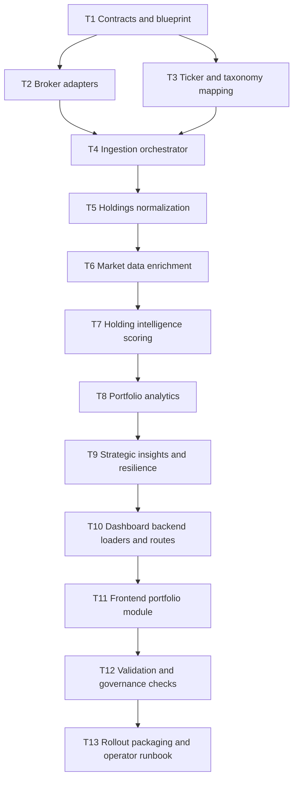

# Portfolio Intelligence Task Graph

- Status: `DESIGN / DRY_RUN`
- Date: `2026-03-11`
- Truth epoch: `TRUTH_EPOCH_2026-03-06_01` (frozen)
- Scope: `US`, `INDIA`

## 1. Delivery Principles

This task graph is the governed implementation sequence for the Portfolio Intelligence Subsystem. It is intentionally staged so the system can be built without violating the current read-only dashboard and no-execution rules.

Execution rules:

- all write-capable ingestion remains outside the dashboard
- all downstream dashboard work is GET-only
- every phase must preserve parity across `US` and `INDIA`
- every phase must expose provenance, truth epoch, and degraded-state behavior

## 2. Dependency Graph

## 3. Work Packages

### T1. Contracts and Blueprint

- Goal: lock the canonical schemas, subsystem boundaries, and governance envelope
- Primary outputs:
  - [src/layers/portfolio_intelligence.py](/C:/GIT/TraderFund/src/layers/portfolio_intelligence.py)
  - portfolio intelligence models package
  - API contracts for dashboard read models
- Acceptance gate:
  - deterministic schemas
  - explicit invariants and obligations
  - no execution hooks

### T2. Broker Adapters

- Goal: parse broker-native exports into a raw import contract
- Priority adapters:
  - India: Zerodha, Groww
  - US: IBKR, Schwab
- Acceptance gate:
  - malformed rows are quarantined, not silently dropped
  - checksum-based import lineage recorded
  - no market-specific schema drift leaks beyond adapter boundaries

### T3. Ticker and Taxonomy Mapping

- Goal: resolve broker symbols into canonical TraderFund symbols and sector taxonomy
- Acceptance gate:
  - unresolved symbols remain visible
  - sector and industry classification supports both `US` and `INDIA`
  - mapping results are auditable and versioned

### T4. Ingestion Orchestrator

- Goal: coordinate adapter execution, duplicate detection, portfolio registry updates, and raw artifact persistence
- Acceptance gate:
  - imports are append-only
  - duplicate detection is deterministic
  - registry updates are atomic

### T5. Holdings Normalization

- Goal: compute canonical holdings and portfolio weights
- Acceptance gate:
  - holdings sum to portfolio total within tolerance
  - every holding has portfolio, market, broker, and currency identity
  - unresolved taxonomy is flagged rather than inferred silently

### T6. Market Data Enrichment

- Goal: attach price, fundamentals, technicals, events, and freshness
- Required integrations:
  - research artifacts
  - macro regime context
  - factor context
  - canonical market data stores
- Acceptance gate:
  - each enriched field has provenance
  - stale inputs degrade confidence instead of blocking the entire portfolio unnecessarily
  - macro gate state is explicit

### T7. Holding Intelligence Scoring

- Goal: compute holding-level intelligence cards
- Required outputs:
  - fundamental score block
  - technical score block
  - factor exposure block
  - sentiment and catalyst block
  - conviction score
  - opportunity classification
  - risk flags
  - regime compatibility
- Acceptance gate:
  - identical inputs yield identical cards
  - no imperative language
  - partial inputs surface insufficient-context flags

### T8. Portfolio Analytics

- Goal: aggregate holdings into institutional portfolio diagnostics
- Required reports:
  - diversification
  - risk diagnostics
  - structure analysis
  - performance analytics
- Acceptance gate:
  - sector, geography, and factor concentration available for both markets
  - macro exposure and correlation clustering use explicit methodology notes
  - combined portfolio calculations preserve per-market lineage

### T9. Strategic Insights and Resilience

- Goal: produce advisory-only portfolio summaries and resilience scoring
- Required outputs:
  - diversification gaps
  - factor imbalance
  - macro regime vulnerability
  - hidden concentration risk
  - positions requiring review
  - regime-aligned holdings
  - deteriorating fundamentals
  - improving momentum
- Acceptance gate:
  - insight text remains observational
  - resilience score explains weakest and strongest dimensions
  - insight provenance is attached

### T10. Dashboard Backend

- Goal: add read-only loaders and routes for portfolio intelligence
- Required endpoints:
  - `GET /api/portfolio/overview/{market}`
  - `GET /api/portfolio/holdings/{market}/{portfolio_id}`
  - `GET /api/portfolio/diversification/{market}/{portfolio_id}`
  - `GET /api/portfolio/risk/{market}/{portfolio_id}`
  - `GET /api/portfolio/structure/{market}/{portfolio_id}`
  - `GET /api/portfolio/performance/{market}/{portfolio_id}`
  - `GET /api/portfolio/insights/{market}/{portfolio_id}`
  - `GET /api/portfolio/resilience/{market}/{portfolio_id}`
  - `GET /api/portfolio/combined`
- Acceptance gate:
  - GET-only
  - includes `truth_epoch`, `trace`, and `data_as_of`
  - matches existing dashboard error conventions

### T11. Frontend Portfolio Module

- Goal: add a portfolio intelligence section to the existing dashboard
- Required views:
  - overview
  - holdings intelligence
  - diversification
  - risk monitor
  - opportunity and risk monitor
  - resilience score
  - combined market view
- Acceptance gate:
  - read-only UX
  - responsive layout
  - degraded and stale states visibly handled

### T12. Validation and Governance Checks

- Goal: prove the subsystem behaves within envelope
- Required validation:
  - determinism
  - market parity
  - provenance presence
  - regime gate visibility
  - honest stagnation
  - dashboard read-only enforcement
- Acceptance gate:
  - no route enables mutation
  - no artifact omits truth epoch
  - no score hides stale or missing upstream inputs

### T13. Rollout Packaging and Operator Runbook

- Goal: make the subsystem operable by a human without embedding execution
- Required outputs:
  - operator import workflow
  - troubleshooting notes
  - degraded-state runbook
  - sample artifacts for US and INDIA
- Acceptance gate:
  - import workflow is manual and explicit
  - dashboard remains observer-only
  - operator can trace any metric back to a source artifact

## 4. Sequencing by Phase

| Phase | Tasks | Outcome |
| --- | --- | --- |
| Phase A | `T1` | contracts and blueprint locked |
| Phase B | `T2-T5` | broker ingestion and normalized holdings available |
| Phase C | `T6-T7` | enriched holdings and holding intelligence available |
| Phase D | `T8-T9` | portfolio diagnostics and advisory insights available |
| Phase E | `T10-T11` | dashboard integration available |
| Phase F | `T12-T13` | governed validation and operator packaging complete |

## 5. Parallelism Rules

Safe parallel work:

- `T2` and `T3` after `T1`
- market-specific adapters inside `T2`
- analytic modules inside `T8` once `T7` is stable
- frontend components inside `T11` once the backend contracts are frozen

Must remain serialized:

- `T1` before any downstream code
- `T6` before `T7`
- `T10` before frontend binding
- `T12` after all user-visible surfaces exist

## 6. Governance Gates

Every major phase should stop at a gate review.

### Gate G1: Contract Integrity

Triggered after `T1`.

Must confirm:

- truth epoch binding
- frozen schemas
- no execution language in contracts

### Gate G2: Data Integrity

Triggered after `T5`.

Must confirm:

- imports and normalization are auditable
- unresolved symbols are visible
- US and INDIA output the same shape

### Gate G3: Analytical Integrity

Triggered after `T9`.

Must confirm:

- regime gates are explicit
- conviction is degraded appropriately when context is stale
- insights remain advisory only

### Gate G4: Surface Integrity

Triggered after `T11`.

Must confirm:

- dashboard routes are GET-only
- provenance is visible in UI payloads
- empty, stale, and partial states are honest

### Gate G5: Release Integrity

Triggered after `T13`.

Must confirm:

- full validation suite passes
- operator runbook exists
- no hidden path introduces execution behavior

## 7. Validation Matrix

| Check | Target |
| --- | --- |
| determinism | identical input artifacts produce identical hashes |
| parity | US and INDIA share contracts and field names |
| latency | portfolio evaluation remains within agreed service budget |
| provenance | all payloads include `trace` and source references |
| truth epoch | all payloads include `truth_epoch` |
| regime gate | every conviction-bearing output includes gate state |
| stale-state honesty | partial or stale data degrades output visibly |
| dashboard scope | all portfolio endpoints are GET-only |

## 8. Current State

This repository now contains the design-level artifacts and the dry-run blueprint bridge in [src/layers/portfolio_intelligence.py](/C:/GIT/TraderFund/src/layers/portfolio_intelligence.py). The full broker ingestion, analytics package, backend endpoints, and frontend module remain future implementation tasks under this graph.
