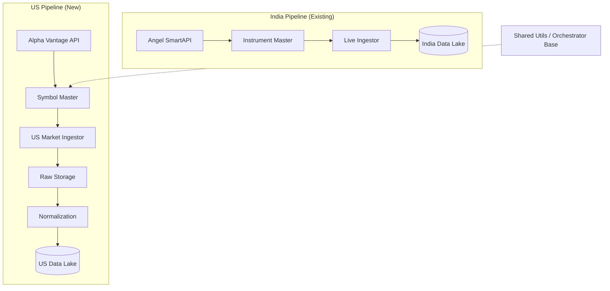

# US Market Engine Design (Alpha Vantage)

## 1. High-Level Architecture

The US Market Engine is designed as a fully independent, parallel ingestion pipeline within the `TraderFund` repository. It mirrors the architectural patterns of the existing India (`angel_smartapi`) engine but operates on a completely separate infrastructure path to strictly isolate market contexts.

### System View



### Comparison with India Engine

| Feature | India Engine (`angel_smartapi`) | US Engine (`alpha_vantage`) |
| :--- | :--- | :--- |
| **Source** | Angel Broking SmartAPI | Alpha Vantage API |
| **Auth** | Session-based (Login/Token) | API Key-based (Stateless) |
| **Symbol Source** | `instrument_master.json` (Dump) | `LISTING_STATUS` CSV Endpoint |
| **Ingestion Mode** | WebSocket (Live) + REST (Hist) | REST Batch Polling (All) |
| **Orchestration** | Event-loop / WebSocket Client | Scheduled Batch Jobs (Cron/Scheduler) |
| **Storage** | Parquet (Date-Partitioned) | Parquet (Symbol/Date-Partitioned) |

---

## 2. US Market Engine Responsibilities

The `alpha_vantage` module is responsible for:

1.  **API Communication**: managing the connection to `https://www.alphavantage.co/query` with strict adherence to rate limits (e.g., free tier constraints).
2.  **Symbol Universe Management**: Maintaining an up-to-date registry of active US equity symbols (NYSE/NASDAQ) and filtering out irrelevant assets (e.g., mutual funds, if desired).
3.  **Data Ingestion**: Fetching OHLCV data for:
    *   **Historical Backfill:** Full history (`outputsize=full`)
    *   **Daily Incremental:** Latest data (`outputsize=compact`)
    *   **Intraday:** Recent interval data (e.g., 5min, 15min)
4.  **Metadata Handling**: Tracking split/dividend events via "Adjusted" endpoints and persisting this metadata alongside price data.
5.  **Rate Limiting & Retries**: Implementing a token-bucket or sliding-window limiter to prevent 429 errors and ensuring 100% data yield through exponential backoff retries.

---

## 3. Pipeline Stages (US Market)

### Stage 1: Symbol Master (`symbol_master.py`)
*   **Input**: `LISTING_STATUS` API endpoint (Alpha Vantage).
*   **Process**:
    *   Fetch active listings (date=latest, state=active).
    *   Filter for `assetType=Stock` and `exchange` in [NYSE, NASDAQ].
    *   Deduplicate and validate symbols.
*   **Output**: `data/master/us/symbols.csv` (Canonical list of active US tickers).

### Stage 2: Raw Ingestion (`raw_ingestor.py`)
*   **Input**: `symbols.csv`, Alpha Vantage Time Series APIs (`TIME_SERIES_DAILY_ADJUSTED`, `TIME_SERIES_INTRADAY`).
*   **Process**:
    *   Iterate through symbol list.
    *   Check rate limit availability.
    *   Fetch raw JSON/CSV payload.
    *   **No transformation** at this stage (ELT pattern).
*   **Output**: `data/raw/us/{date}/{symbol}_{function}.json`
*   **Failure Handling**: Failed symbols are logged to a `retry_queue` for a secondary pass.

### Stage 3: Normalization & Staging (`normalizer.py`)
*   **Input**: Raw JSON files.
*   **Process**:
    *   Parse JSON body.
    *   Extract `Time Series` and `Meta Data`.
    *   Standardize timestamps to UTC.
    *   Convert types (float, int).
    *   Handle "Adjusted" columns (Split Coefficient, Dividend Amount).
*   **Output**: `data/staging/us/ohlcv/{frequency}/{symbol}.parquet` (Append-only or overwrite-partition).

### Stage 4: Curated / Analytics-Ready (`curator.py`)
*   **Input**: Staged Parquet files.
*   **Process**:
    *   Quality Checks: Remove zero-volume candles (if policy dictates), check for gaps.
    *   Adjustment application (if storing adjusted prices separately).
    *   Sort and deduplicate by timestamp.
*   **Output**: `data/analytics/us/candles_1d.parquet`, `data/analytics/us/candles_5m.parquet`.

---

## 4. Data Model & Contracts

### Schema: US OHLCV (Daily)

| Column Name | Type | Description |
| :--- | :--- | :--- |
| `timestamp` | `datetime64[ns, UTC]` | Candle open time (UTC) |
| `symbol` | `string` | Ticker Symbol (e.g., AAPL) |
| `open` | `float64` | Raw Open Price |
| `high` | `float64` | Raw High Price |
| `low` | `float64` | Raw Low Price |
| `close` | `float64` | Raw Close Price |
| `volume` | `int64` | Session Volume |
| `adj_close` | `float64` | Adjusted Close (from AV) |
| `dividend_amt` | `float64` | Dividend amount (if any) |
| `split_coef` | `float64` | Split coefficient (default 1.0) |

### Key Differences from India Schema
*   **Currency**: Values are in USD (implicit).
*   **Timezone**: Master time is UTC. India pipeline uses IST (Asia/Kolkata). **Strict separation** prevents cross-contamination.
*   **Market Hours**: US Market hours (09:30 - 16:00 ET) vs India (09:15 - 15:30 IST).
*   **Adjustments**: Alpha Vantage provides explicit "Adjusted Close" and split coefficients in the daily feed. SmartAPI requires separate corporate action reconciliation.

---

## 5. Scheduling & Orchestration

The orchestration will reuse the `scheduler` pattern but run logically distinct jobs.

### Jobs
1.  **`US_Symbol_Refresh`**: Runs Weekly (Monday Morning). Updates `symbols.csv`.
2.  **`US_Daily_Close_Fetch`**: Runs Daily (e.g., 17:00 ET).
    *   Fetches `TIME_SERIES_DAILY_ADJUSTED`.
    *   Uses `outputsize=compact` for efficiency.
3.  **`US_Intraday_Catchup`**: Runs Hourly (during market hours, if rate limits permit) or End-of-Day.
    *   Fetches `TIME_SERIES_INTRADAY` (interval=5min).
4.  **`US_Backfill_Worker`**: Manual trigger.
    *   Iterates full universe with `outputsize=full`.
    *   Uses strict rate limiting (e.g., 5 calls/min and 500 calls/day for Free Tier safety).

### Orchestration Logic (`scheduler.py`)
*   Implements a **RateLimitSemaphore**: A persistent or in-memory counter that blocks execution if API usage exceeds thresholds (`MAX_CALLS_PER_MINUTE`, `MAX_CALLS_PER_DAY`).

---

## 6. Storage Strategy

The storage hierarchy mirrors the data lake structure:

```text
data/
├── raw/
│   └── us/
│       ├── 2023-10-27/
│       │   ├── AAPL_daily.json
│       │   └── MSFT_daily.json
├── staging/
│   └── us/
│       └── daily/
│           └── AAPL.parquet
└── analytics/
    └── us/
        └── prices/
            ├── frequency=1d/
            │   └── part-0001.parquet
            └── frequency=5min/
                └── part-0001.parquet
```

*   **Partitioning**: Hierarchy ensures efficient querying by symbol or date.
*   **Retention**:
    *   **Raw**: 30 days (for debugging/replay).
    *   **Staging/Analytics**: Indefinite (Source of Truth).

---

## 7. Error Handling & Observability

*   **API Throttling (429/Note)**:
    *   Alpha Vantage returns a JSON with a "Note" key when limited (200 OK status sometimes, or 429).
    *   **Action**: Immediate pause of ingestion thread for `RETRY_DELAY` (e.g., 60s).
*   **Empty/Missing Data**:
    *   Log warning.
    *   Do not overwrite existing data with empty sets.
*   **Logging**:
    *   Structured logs (`api_ingestion.us.log`) tracking: `symbol`, `endpoint`, `status`, `records_fetched`, `latency`.
*   **Alerts**:
    *   Raise alert if `Symbol_Refresh` returns 0 symbols.
    *   Raise alert if `Daily_Close_Fetch` fails for > 10% of universe.

---

## 8. Extensibility Roadmap

This design lays the foundation for:

*   **Alpha Intelligence**: Using the `NEWS_SENTIMENT` endpoint can be added as a separate `NewsIngestor` class reusing the `US_Symbol_Refresh` list.
*   **Technical Overlay**: A `TechnicalIngestor` can be added to fetch `SMA`, `RSI` etc., storing them in an `indicators/` folder parallel to `prices/`.
*   **Global Expansion**: The `alpha_vantage` module handles `function` and `symbol` generically, allowing easy adaptation for UK/Canada markets if `symbols.csv` is updated.

---

## 9. Explicit Non-Goals

*   **Real-time Streaming**: Alpha Vantage is REST-based (except mostly premium websockets which are out of scope for this design). We target batch updates.
*   **Order Execution**: This is a pure Read-Only data pipeline.
*   **Unified Schema**: We intentionally do **not** merge India and US data into a single table. They remain in separate schemas to handle valid regulatory and structural differences.
